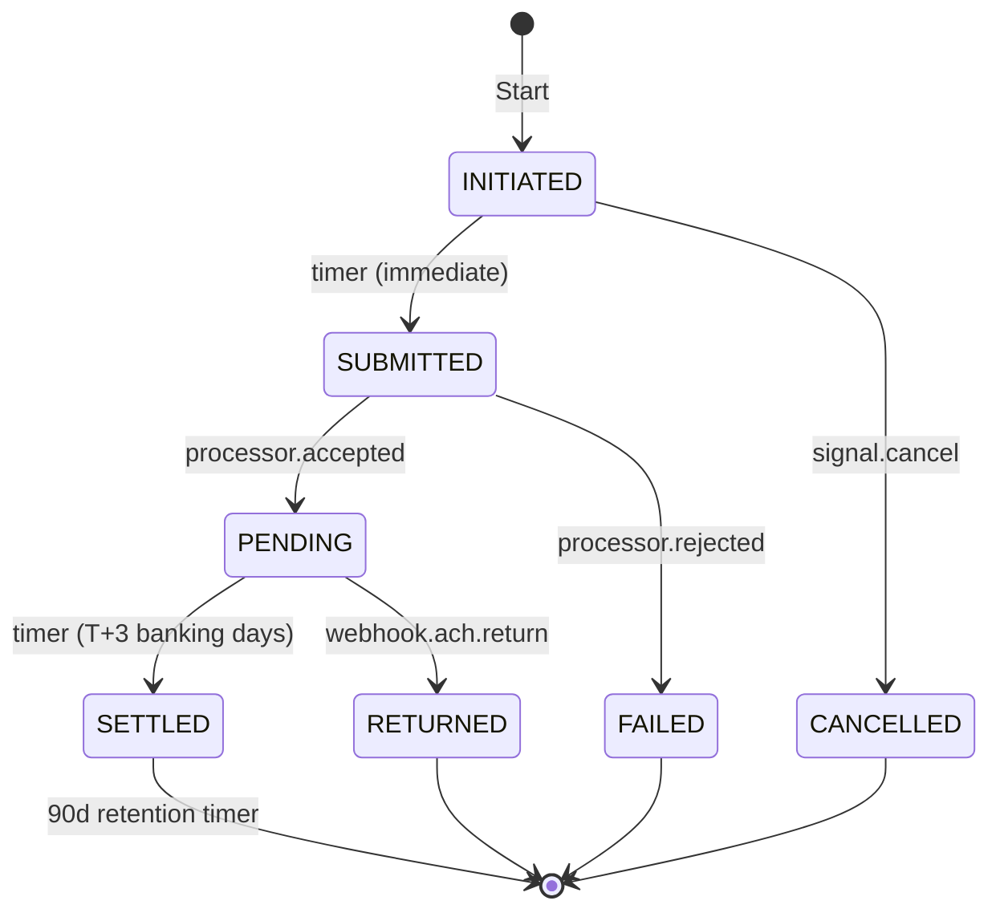
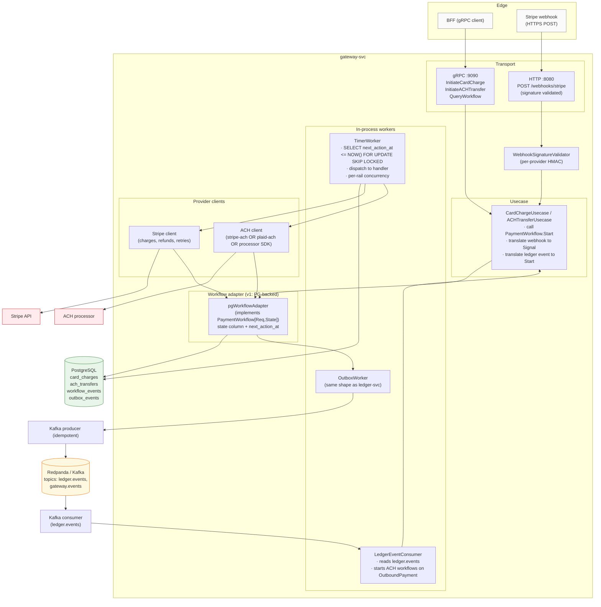

# gateway-svc — charter and v1 design

This is a **planning doc**, not a description of shipped code. As of
HEAD, `apps/gateway-svc/` is a 15-line stub. This doc names what it
should be, sketches the v1 design, and analyzes the v2 workflow-engine
options (Temporal, Restate, others) with a recommendation.

## Charter — purpose

gateway-svc is the **outbound and external-integration boundary** of
the platform. Its job is to keep ledger-svc clean of every messy
external concern (provider APIs, webhook signatures, multi-day
settlement windows, PCI scope, sanctions screens) while still letting
money move in and out of the system durably.

```
inbound (client → us)         outbound (us → external)
    ┌──────────┐                    ┌──────────────┐
    │   BFF    │                    │ gateway-svc  │
    │  (GQL)   │                    │   (gRPC)     │
    └────┬─────┘                    └──────┬───────┘
         │                                 │
         │       ┌──────────────────┐      │
         └──────▶│   ledger-svc     │◀─────┘
                 │  (gRPC, books)   │
                 └──────────────────┘
                  internal source of truth
                  (no knowledge of Stripe/Visa/ACH)
```

ledger-svc is the **internal** source of truth — accounts, transfers,
journal entries. Knows nothing about Stripe, Visa, Plaid, ACH, SWIFT.

gateway-svc is the **external boundary** — knows everything about
payment processors and rails, translates between their world and ours.

### What gateway-svc owns

1. **Outbound payment execution** — withdrawals, disbursements,
   payouts. Picks the right processor by country/currency/cost,
   tracks the long-lived state machine, publishes settlement events
   back to ledger-svc.
2. **Inbound payment reception** — deposits, funding, top-ups.
   Receives webhooks, validates signatures, normalizes payloads,
   publishes `FundsArrived` events for ledger-svc to consume.
3. **Provider routing and failover** — multi-rail in v2; single
   processor in v1.
4. **PCI / regulatory scope isolation** — if the platform ever
   touches raw PAN, only gateway-svc is in PCI scope.

### What gateway-svc does NOT own

- **No internal account state.** Balances, journal entries — all in
  ledger-svc.
- **No client-facing API.** Clients call BFF; BFF calls gateway-svc.
- **No business policy.** Limits, fees, fraud rules live elsewhere.
- **No reconciliation source-of-truth.** Reconciliation happens at
  the ledger level using both sides' data.

### Integration model

Same outbox pattern as ledger-svc internally. Two-way:

```
ledger-svc → outbox → Kafka topic ledger.events  → gateway-svc consumes
gateway-svc → outbox → Kafka topic gateway.events → ledger-svc consumes
```

Loose coupling — either service can be down without corrupting the
other's state. Both consume idempotently.

## v1 scope (constrained on purpose)

The trap with "payments gateway" is going broad too fast. v1 is:

1. **One processor**: Stripe (default; substitute your prod-pinned vendor).
2. **Two flows**: card-in (deposit) + ACH-out (withdrawal).
3. **PG-backed state machine** behind a swappable workflow interface.
4. **Webhook receiver** with signature validation + dedup.
5. **Outbox + Kafka** topic for events going back to ledger-svc.
6. **Kafka consumer** for `ledger.events` (ACH-out is initiated this way).

Provider routing, failover, cost optimization, multi-rail support —
all v2+. A working single-processor gateway is more useful than a
half-built multi-processor one.

## v1 design — workflow interface

The interface is the moat. Designed so v2 can swap the implementation
to Temporal / Restate / whatever without changing the usecase layer.

### Domain types

```go
// internal/domain/workflow.go

// WorkflowKind enumerates the per-rail state machines. Each kind
// has its own request type, state enum, and event vocabulary.
type WorkflowKind string

const (
    WorkflowKindCardCharge  WorkflowKind = "card_charge"   // Stripe in
    WorkflowKindACHTransfer WorkflowKind = "ach_transfer"  // ACH out
)

// WorkflowID is the durable handle to one in-flight workflow. uuidv7
// internally; the typed wrapper keeps callers from passing a random
// uuid.UUID where a workflow id is wanted.
type WorkflowID struct {
    Kind WorkflowKind
    ID   uuid.UUID
}

// PaymentWorkflow is the implementation seam. v1 fulfilled by a
// PG-backed adapter (state column + polling worker). v2 fulfilled by
// a Temporal/Restate adapter. Usecases depend only on this interface.
//
// Type parameters carry the request / state shapes per kind so the
// interface is type-safe without leaking implementation details.
type PaymentWorkflow[Req, State any] interface {
    // Start registers a new workflow. Idempotent on (TenantID,
    // IdempotencyKey) inside Req — caller can replay safely.
    Start(ctx context.Context, req Req) (WorkflowID, error)

    // Signal delivers an external event into a running workflow.
    // Webhook arrivals, manual approvals, refund commands all flow
    // through here. Idempotent on Event.ID.
    Signal(ctx context.Context, id WorkflowID, ev Event) error

    // Query returns the current snapshot. Read path; doesn't change
    // state. Used by BFF for status pages and by reconciler sweeps.
    Query(ctx context.Context, id WorkflowID) (Snapshot[State], error)

    // Cancel terminates the workflow if its current state allows it.
    // Returns ErrCannotCancel for workflows past the point of no
    // return (e.g., card already captured, ACH already submitted).
    Cancel(ctx context.Context, id WorkflowID, reason string) error
}

// Event is the signal envelope. Kind discriminates the payload; the
// adapter routes into the appropriate state-transition handler.
type Event struct {
    ID         uuid.UUID  // for dedup — webhook may retry
    Kind       string     // 'webhook.charge.succeeded', 'manual.refund', ...
    OccurredAt time.Time
    Source     string     // 'stripe', 'support-tool', 'reconciler', ...
    Payload    []byte     // canonical bytes, kind-specific
}

// Snapshot is the read-side projection of a workflow.
type Snapshot[State any] struct {
    ID            WorkflowID
    State         State        // typed state enum, e.g., CardChargeState
    CreatedAt     time.Time
    UpdatedAt     time.Time
    NextActionAt  *time.Time   // when the next timer fires (if any)
    NextAction    string       // what will happen at NextActionAt
    History       []HistoryRecord
    LastError     string       // populated for FAILED states
}

type HistoryRecord struct {
    EventType string    // 'STATE_CHANGED', 'WEBHOOK_RECEIVED', 'TIMER_FIRED', ...
    OccurredAt time.Time
    Details    []byte
}
```

### Per-kind concretizations

```go
// internal/domain/card_charge.go

type CardChargeRequest struct {
    TenantID         string
    IdempotencyKey   string
    UserAccountID    uuid.UUID
    Amount           Amount       // domain money type, NUMERIC(19,4)
    Currency         Currency
    PaymentMethodTok string       // Stripe payment_method id
    LedgerTransferID *uuid.UUID   // backref into ledger if pre-allocated
}

type CardChargeState string

const (
    CardChargeInitiated   CardChargeState = "INITIATED"
    CardChargeAuthorizing CardChargeState = "AUTHORIZING"   // Stripe call in flight
    CardChargeAuthorized  CardChargeState = "AUTHORIZED"
    CardChargeCaptured    CardChargeState = "CAPTURED"
    CardChargeSettled     CardChargeState = "SETTLED"       // funds in our merchant account
    CardChargeFailed      CardChargeState = "FAILED"
    CardChargeVoided      CardChargeState = "VOIDED"
    CardChargeRefunded    CardChargeState = "REFUNDED"
    CardChargeChargeback  CardChargeState = "CHARGEBACK"
    CardChargeAbandoned   CardChargeState = "ABANDONED"     // auth window expired
)

type CardChargeWorkflow = PaymentWorkflow[CardChargeRequest, CardChargeState]
```

```go
// internal/domain/ach_transfer.go

type ACHTransferRequest struct {
    TenantID            string
    IdempotencyKey      string
    UserAccountID       uuid.UUID
    Amount              Amount
    Currency            Currency  // typically USD for v1
    DestinationAccount  string    // tokenized — never raw routing/account
    LedgerTransferID    uuid.UUID // ledger has already debited
}

type ACHTransferState string

const (
    ACHInitiated ACHTransferState = "INITIATED"
    ACHSubmitted ACHTransferState = "SUBMITTED"   // sent to processor
    ACHPending   ACHTransferState = "PENDING"     // in NACHA window
    ACHSettled   ACHTransferState = "SETTLED"     // confirmed at recipient
    ACHReturned  ACHTransferState = "RETURNED"    // ACH return code received
    ACHFailed    ACHTransferState = "FAILED"      // processor rejected at submit
    ACHCancelled ACHTransferState = "CANCELLED"   // before submission only
)

type ACHTransferWorkflow = PaymentWorkflow[ACHTransferRequest, ACHTransferState]
```

### State transitions

Card charge (Stripe in):


ACH transfer (out):



## v1 design — schema

Per-rail tables. Each gets its own state enum, rail-specific columns,
and a CHECK constraint enforcing valid states. Generic columns live
on every workflow table (`tenant_id`, `state`, `next_action_at`,
`updated_at`).

### Migrations

`migrations/001_init_gateway.up.sql`:

```sql
-- Card charges (Stripe in).
--
-- One row per inbound payment attempt. Holds the full lifecycle from
-- INITIATED through SETTLED + 60d retention. provider_ref is the
-- Stripe charge id once we've called the API; idempotency_key is
-- caller-provided and tenant-scoped (mirrors ledger-svc's pattern).
CREATE TABLE card_charges (
    id                   UUID            PRIMARY KEY DEFAULT uuidv7(),
    tenant_id            VARCHAR(128)    NOT NULL,

    -- correlation
    user_account_id      UUID            NOT NULL,
    idempotency_key      VARCHAR(255)    NOT NULL,
    ledger_transfer_id   UUID,                                -- nullable: set after ledger commit

    -- money
    amount               NUMERIC(19, 4)  NOT NULL,
    currency             VARCHAR(3)      NOT NULL,

    -- provider
    provider             VARCHAR(40)     NOT NULL,            -- 'stripe' for v1
    payment_method_tok   VARCHAR(255)    NOT NULL,            -- tokenized; never PAN
    provider_ref         VARCHAR(255),                        -- stripe charge_id
    provider_error_code  VARCHAR(80),
    provider_error_msg   TEXT,

    -- state machine
    state                VARCHAR(40)     NOT NULL
                                         CHECK (state IN (
                                             'INITIATED','AUTHORIZING','AUTHORIZED',
                                             'CAPTURED','SETTLED',
                                             'FAILED','VOIDED','REFUNDED',
                                             'CHARGEBACK','ABANDONED'
                                         )),
    state_changed_at     TIMESTAMPTZ     NOT NULL DEFAULT NOW(),

    -- timer-based transitions; the polling worker scans this
    next_action_at       TIMESTAMPTZ,
    next_action          VARCHAR(40),                         -- 'submit_to_stripe', 'mark_settled', 'expire_auth', ...
    next_action_attempts INT             NOT NULL DEFAULT 0,  -- bumped on retry

    -- metadata
    created_at           TIMESTAMPTZ     NOT NULL DEFAULT NOW(),
    updated_at           TIMESTAMPTZ     NOT NULL DEFAULT NOW(),

    CONSTRAINT card_charges_tenant_idem UNIQUE (tenant_id, idempotency_key)
);

-- Hot path for the polling worker: "next workflows to drive forward".
-- Partial index keeps it tiny (only rows with a scheduled timer
-- live here).
CREATE INDEX idx_card_charges_next_action
    ON card_charges (next_action_at)
    WHERE next_action_at IS NOT NULL;

CREATE INDEX idx_card_charges_provider_ref
    ON card_charges (provider, provider_ref)
    WHERE provider_ref IS NOT NULL;

-- ACH transfers (out).
CREATE TABLE ach_transfers (
    id                   UUID            PRIMARY KEY DEFAULT uuidv7(),
    tenant_id            VARCHAR(128)    NOT NULL,

    user_account_id      UUID            NOT NULL,
    idempotency_key      VARCHAR(255)    NOT NULL,
    ledger_transfer_id   UUID            NOT NULL,             -- ACH-out always has a prior debit

    amount               NUMERIC(19, 4)  NOT NULL,
    currency             VARCHAR(3)      NOT NULL,

    provider             VARCHAR(40)     NOT NULL,             -- 'stripe-ach' or 'plaid-ach' or direct
    destination_token    VARCHAR(255)    NOT NULL,             -- bank account token
    provider_ref         VARCHAR(255),
    return_code          VARCHAR(20),                          -- ACH return code (R01–R85)

    state                VARCHAR(40)     NOT NULL
                                         CHECK (state IN (
                                             'INITIATED','SUBMITTED','PENDING',
                                             'SETTLED','RETURNED','FAILED','CANCELLED'
                                         )),
    state_changed_at     TIMESTAMPTZ     NOT NULL DEFAULT NOW(),
    next_action_at       TIMESTAMPTZ,
    next_action          VARCHAR(40),
    next_action_attempts INT             NOT NULL DEFAULT 0,

    created_at           TIMESTAMPTZ     NOT NULL DEFAULT NOW(),
    updated_at           TIMESTAMPTZ     NOT NULL DEFAULT NOW(),

    CONSTRAINT ach_transfers_tenant_idem UNIQUE (tenant_id, idempotency_key)
);

CREATE INDEX idx_ach_transfers_next_action
    ON ach_transfers (next_action_at)
    WHERE next_action_at IS NOT NULL;

-- Workflow event log — append-only audit / debug trail.
--
-- Every signal received, every state transition, every timer firing
-- gets a row here. Used for audit, debugging, and the Snapshot.History
-- field. Does NOT carry duplicates of state — `card_charges.state` is
-- the source of truth for current state; this table is the log of how
-- we got there.
CREATE TABLE workflow_events (
    id            BIGSERIAL       PRIMARY KEY,
    workflow_kind VARCHAR(40)     NOT NULL,                  -- 'card_charge' | 'ach_transfer'
    workflow_id   UUID            NOT NULL,
    tenant_id     VARCHAR(128)    NOT NULL,
    event_type    VARCHAR(60)     NOT NULL,                  -- 'STATE_CHANGED', 'WEBHOOK_RECEIVED', 'TIMER_FIRED', ...
    from_state    VARCHAR(40),
    to_state      VARCHAR(40),
    source        VARCHAR(40)     NOT NULL,                  -- 'stripe', 'support-tool', 'timer', 'reconciler', ...
    external_event_id VARCHAR(255),                          -- webhook id, signal dedup key
    payload       JSONB,
    occurred_at   TIMESTAMPTZ     NOT NULL DEFAULT NOW()
);

CREATE INDEX idx_workflow_events_handle
    ON workflow_events (workflow_kind, workflow_id, id);

-- Webhook dedup: every external webhook id is recorded here under a
-- UNIQUE constraint, so duplicate deliveries from the processor
-- become harmless no-ops at the gateway layer.
CREATE UNIQUE INDEX idx_workflow_events_external_dedup
    ON workflow_events (source, external_event_id)
    WHERE external_event_id IS NOT NULL;

-- Outbox (events FROM gateway-svc TO ledger-svc / other consumers).
-- Same pattern as ledger-svc/outbox_events. Drained by an in-process
-- worker via FOR UPDATE SKIP LOCKED.
CREATE TABLE outbox_events (
    id             UUID         PRIMARY KEY DEFAULT uuidv7(),
    aggregate_type VARCHAR(50)  NOT NULL,
    aggregate_id   UUID         NOT NULL,
    event_schema   VARCHAR(80)  NOT NULL,
    payload        BYTEA        NOT NULL,                    -- proto bytes
    status         VARCHAR(20)  NOT NULL DEFAULT 'PENDING'
                                CHECK (status IN ('PENDING','PUBLISHED')),
    created_at     TIMESTAMPTZ  NOT NULL DEFAULT NOW()
);

CREATE INDEX idx_outbox_pending ON outbox_events (created_at)
    WHERE status = 'PENDING';
```

### Why per-rail tables, not one generic `payment_workflows` table

Tried both shapes mentally. Per-rail wins:

- **Distinct state enums per rail** are stronger than a generic
  `state VARCHAR` for catching invalid transitions at the DB layer.
- **Rail-specific columns** (`return_code` for ACH, `provider_error_code`
  for cards, etc.) don't pollute every row with NULLs.
- **Polling worker scans are smaller** — each rail has its own next-
  action index, no mixing with unrelated rail data.
- **Migration of one rail to v2 (Temporal) doesn't disturb others** —
  card_charges can move to Temporal while ach_transfers stays on PG,
  if that's the right call at the time.

The interface still hides this from callers; the adapter routes to
the right table based on `WorkflowKind`.

## v1 design — components



### Component breakdown

**Transport layer:**

- gRPC server on `:9090` for BFF-to-gateway calls
  (`InitiateCardCharge`, `InitiateACHTransfer`, `QueryWorkflow`,
  `CancelWorkflow`).
- HTTP server on `:8080` for webhook receivers (`POST /webhooks/stripe`,
  later `/webhooks/plaid` etc.). Webhooks must be HTTP because that's
  what processors send.

**Webhook signature validator:**

- Per-provider HMAC-SHA256 (Stripe), or per-provider equivalent.
- Validates the raw body before any deserialization. Reject malformed
  with 400; missing signature with 401.
- Looks up dedup key (`source = 'stripe'` + `external_event_id =
  webhook.id`) in `workflow_events`. If exists, return 200 idempotently.

**Usecase layer:**

- One usecase per flow (CardChargeUsecase, ACHTransferUsecase).
- Translates external concepts (Stripe charge id, ACH submission)
  into workflow signals.
- Holds the business policy that's *gateway-specific* (e.g., "if
  Stripe returns an unrecoverable error, transition to FAILED" — that
  decision is gateway-svc's, not the workflow adapter's).

**Workflow adapter (v1):**

- Implements `PaymentWorkflow[Req,State]` for each rail.
- `Start` inserts into the rail-specific table with `state =
  INITIATED, next_action_at = NOW()`.
- `Signal` looks up the workflow, calls the appropriate state
  transition function (kind+from-state → handler), updates the row.
- `Query` reads the row + recent `workflow_events`.
- All writes go through `InTx` with the same SERIALIZABLE-or-READ-COMMITTED
  pattern as ledger-svc (start with SERIALIZABLE; revisit if Tier-4-style
  isolation review applies here too).

**TimerWorker:**

- One worker pool per rail, pulls from
  `SELECT id FROM <table> WHERE next_action_at <= NOW() ORDER BY
  next_action_at LIMIT N FOR UPDATE SKIP LOCKED`.
- Dispatches to the handler matching `next_action`.
- Handler is a function `(ctx, workflowID) → newState | error`.
- On success: state-transition + clear or reschedule `next_action_at`.
- On error: increment `next_action_attempts`, exponential backoff
  reschedule. Permanent failure (max attempts) transitions to FAILED.

**OutboxWorker:**

- Lifted directly from ledger-svc. Same `FOR UPDATE SKIP LOCKED` drain
  pattern, same idempotent Kafka producer (acks=all). Publishes
  `gateway.events` topic to Redpanda.

**LedgerEventConsumer:**

- Subscribes to `ledger.events` (Kafka). On `OutboundPaymentInitiated`
  events, starts an ACH-out workflow.
- Idempotent on the Kafka event id — duplicate consumption produces
  one workflow, not many.

**Provider clients:**

- Thin SDK wrappers around Stripe Go SDK / chosen ACH processor.
- Each method has its own retry policy + circuit breaker
  (per-provider, similar to ledger-svc's per-(tenant,method) breaker).
- No business logic — just "call API, return typed result or typed
  error".

### Operational notes

- **Same env / config / observability shape as ledger-svc.** Reuse
  `internal/config`, `internal/observability`, `internal/transport/grpc/interceptors`.
  Don't reinvent.
- **Two pgxpools** like ledger-svc: requestPool for gRPC handlers,
  workerPool for TimerWorker + OutboxWorker + LedgerEventConsumer.
- **Reconciler additions** for stuck-workflow sweeps:
  - "card charges in AUTHORIZED for > 7 days, no capture" → page
  - "ACH in PENDING for > 5 banking days" → page
  - "workflows where outbox event hasn't published in > 5 min" →
    page (already handled by ledger-svc reconciler pattern)
- **PCI scope.** If we ever hold raw PAN, only this service does, and
  it requires a separate compliance review. v1 takes payment method
  tokens only — never raw card data.

## v1 — what's deferred

| Item | Why deferred |
|---|---|
| Multi-provider routing | One processor is enough for v1. Adding routing logic up-front bakes in assumptions about a provider mix we haven't measured. |
| Provider failover | Same. v1 retries within one provider; cross-provider retry is v2. |
| Cost optimization | Need real volume data first. Premature. |
| Cross-currency / FX | Adds a whole subsystem (rate sourcing, locking). Not in v1 scope. |
| Bulk/batch payouts | Per-transaction is the simpler path. Bulk submissions can be added later as a separate workflow kind. |
| Saga compensations across providers | The "if Stripe fails, try Adyen" pattern. v2 territory. |
| Card vault / PCI tokenization | Defer to processor's vault (Stripe.js, Plaid Link). Don't build our own. |

---

## v2 — workflow engine evaluation

The interface above is designed to be swappable. v2 picks a workflow
engine and re-implements the adapter behind the same `PaymentWorkflow`
contract. Usecase code doesn't change.

This section is the analysis: when to migrate, what to migrate to, and why.

### When to even consider migration

Don't migrate on principle. Migrate when at least one of these is
true and measured:

1. **3+ external rails with materially different timing.** Each rail
   becomes a state machine; the polling worker becomes a fleet of
   per-rail workers; saga patterns emerge ("if rail A fails, try rail
   B, compensate on the ledger side"). At this scale the
   hand-rolled-PG approach starts looking like a poorly-implemented
   workflow engine.
2. **Real saga / compensation patterns.** Multi-step flows where step
   3 failure has to roll back steps 1 and 2 across different
   providers. Encoding this in PG state-tables is doable but the
   error paths get fiddly.
3. **In-flight workflow count > ~10K active.** Polling workers
   degrade gracefully but the queueing latency starts to show. A
   workflow engine's matching service is built for this scale.
4. **Workflow-level observability that wants a UI.** "Where is this
   transaction stuck right now, and why?" — answered by Temporal Web
   for free. A custom admin UI is real engineering work.
5. **Workflow versioning becomes an active concern.** When you have
   100K workflows mid-flight and need to deploy a code change to the
   workflow logic, the engine handles it; PG state-table migrations
   handle it badly.

If none of those are biting, **stay on PG**. The migration cost isn't free.

### Options

#### Option A — Temporal (self-hosted or Cloud)

The de facto Go workflow engine. Forked from Cadence (Uber). Used by
Stripe, Snap, Coinbase, Datadog.

**Architecture:** four service types (Frontend, History, Matching,
Worker) + persistence backend (Postgres / MySQL / Cassandra) +
Temporal Web for observability. Workers run in *your* code and host
the workflow + activity functions.

**Pros:**

- Most production-hardened option. Multi-day timers are battle-tested.
  Workflow versioning (`workflow.GetVersion`) is mature.
- Go SDK is first-class. Java/TS/Python/PHP/.NET/Ruby SDKs available.
- Workflow history is a complete audit trail by construction. Every
  decision, signal, activity result, timestamped. Useful for
  compliance.
- Large community, abundant production examples.
- Temporal Cloud removes the self-host operational burden ($1–5K/month
  at startup scale; scales with workflow count).

**Cons:**

- Heavy ops if self-hosted. 4 service types + persistence + Web UI —
  real SRE budget. Multi-region setup is non-trivial.
- Determinism rules in workflow code: no `time.Now()`, no
  `uuid.NewV7()`, no goroutines, no direct HTTP/RPC calls — those
  must go through activities. Real learning curve.
- History grows with workflow length; long-running workflows
  (60-day dispute windows) need archival strategy.
- Workflow code changes require version-aware patches if in-flight
  workflows exist. Discipline required.

**For our system:**

- Fits the shape really well (long-lived workflows, timers, signals,
  saga patterns).
- Temporal Cloud is the realistic deployment — self-hosting adds a
  whole stateful-system to our ops surface (we already have PG +
  Redis + Redpanda + ledger + gateway).
- If we're growing toward 5+ rails, this becomes the obvious answer.

#### Option B — Restate

Newer (2023+). Lighter-weight, single-binary workflow engine.
Different model from Temporal: stateful "Virtual Objects" + invocation
journaling.

**Architecture:** single Restate server binary + persistence (RocksDB
embedded by default, or Postgres). Your code runs handlers; Restate
calls them via HTTP and journals each call's result for replay.

**Pros:**

- Single binary. Much lighter ops than Temporal.
- HTTP-based invocation model — language-agnostic, no SDK lock-in.
- Workflow code is closer to "normal Go" — fewer determinism rules.
  State is an explicit `ctx.Get/Set` call, not an implicit closure
  variable.
- Strong durability story (RocksDB or PG-backed log).
- Modern design influenced by lessons from Temporal/Cadence.

**Cons:**

- Much smaller community. Production deployments at fintech scale
  are not yet public.
- Less mature ecosystem (fewer examples, fewer libraries, fewer
  Stack Overflow answers).
- HTTP invocation has more overhead per call than Temporal's gRPC.
  Probably negligible at our scale; matters at 100K+ TPS.
- Versioning story for in-flight workflows is less established than
  Temporal's.

**For our system:**

- The "single binary" framing is appealing for our small ops budget.
- Risk of betting on a less-mature project — if Restate stalls or
  pivots, we're stuck.
- Worth piloting on a non-critical workflow first (e.g.,
  `compliance-cli` batch workflows) before committing the gateway to
  it.

#### Option C — DBOS

Postgres-native durable execution. Workflows are Go/TS functions;
DBOS journals each call to PG.

**Architecture:** a library, not a server. Workflow state lives in
your existing Postgres. No separate service to operate.

**Pros:**

- Zero new operational surface — uses our existing PG.
- Code looks like normal Go, with `@workflow` and `@step` decorators.
- Recent academic-grade work; Mike Stonebraker (Postgres co-founder)
  involved.

**Cons:**

- Very new (2023+). Production hardening is unproven.
- Library, not a service — workflow concurrency lives in your app
  process, no separate scheduling tier.
- Smaller ecosystem than even Restate.

**For our system:**

- Conceptually the closest match to "stay on PG, get workflow
  semantics for free."
- But betting on a brand-new project for a money-moving subsystem is
  risky. Defer; reconsider in 12–18 months when it has real
  production miles.

#### Option D — AWS Step Functions (or GCP Workflows / Azure Durable Functions)

Cloud-managed workflow engine. State machine definitions in JSON/YAML
(Amazon States Language). Activities are Lambda functions or HTTP
endpoints.

**Pros:**

- Fully managed, no ops surface.
- Tight integration with cloud services if we're already deep in one.
- Generous free tier; reasonable pricing at scale.

**Cons:**

- Cloud lock-in. Migration off is a rewrite.
- ASL (state machine definition language) is JSON — not as expressive
  as code workflows. Simple state machines fit; complex saga patterns
  awkward.
- Step Functions has a 1-year max workflow duration — a hard limit
  that rules out long-running disputes.
- Activity invocation is via Lambda (cold starts) or polling, not
  the most efficient at high throughput.

**For our system:**

- Only worth considering if we commit to AWS. Not stated.
- Even then, the cloud lock-in feels expensive for a money-moving
  subsystem we want full control of.
- Skip unless cloud strategy changes.

#### Option E — Inngest

Developer-focused, JS/TS-native (Go SDK exists). Hosted-first; can
self-host.

**Pros:**

- Excellent DX — workflow code looks like normal async functions.
- Hosted option removes ops burden.

**Cons:**

- Go SDK is secondary to the JS/TS focus; less production miles in Go.
- Hosted = vendor lock-in.
- Self-host story is less mature than Temporal's.

**For our system:**

- Skip. Go is our primary language; we want best-in-class Go support,
  not "Go SDK exists but isn't the focus."

#### Option F — Stay on PG state machine indefinitely

The honest "do nothing" option.

**When this is right:**

- v1 design proves out at the throughput we need.
- We never hit the migration triggers (3+ rails, real sagas, 10K+
  in-flight, observability pain, versioning pain).
- Ops budget stays small.

**Cost:**

- Reliability bugs we'd have to find and fix ourselves (Temporal has
  found and fixed the equivalents for years).
- Custom admin UI for "what's stuck."
- Custom replay tooling for DR.
- Each addition is small individually; cumulative cost adds up.

For lots of fintechs at our scale, **this is the right answer for a
long time.**

### Comparison summary

| Option | Ops cost | Production maturity | Go-native | Vendor risk | Right when |
|---|---|---|---|---|---|
| **A. Temporal (Cloud)** | Low ($) | Very high | Yes | Low (Temporal is established) | 3+ rails, growing scale, can pay |
| A'. Temporal (self-host) | High | Very high | Yes | Low | 3+ rails, have SRE budget |
| **B. Restate** | Low | Medium (newer) | Yes | Medium (younger project) | want lighter than Temporal, willing to bet on newer |
| C. DBOS | Very low | Low (very new) | Yes | High (very new project) | reconsider in 12–18 months |
| D. AWS Step Functions | None | High | OK | High (cloud lock-in) | already deep in AWS |
| E. Inngest | Low–Med | Medium | OK (secondary) | Medium | JS/TS-heavy stack (we're not) |
| **F. Stay on PG** | None new | High (we built it) | Native | None | as long as triggers don't fire |

### Recommendation

**v1: Stay on PG state machine.** Build the design above. Most likely
right answer for the next 12+ months.

**v2 (when triggers fire): Temporal Cloud.**

Rationale:

- Production maturity matters most for a money-moving subsystem.
  Temporal has 5+ years of production hardening at scale (Stripe,
  Snap, Coinbase). Restate, DBOS, Inngest don't yet.
- Go-native workflow code with first-class SDK support.
- Temporal Cloud removes the self-host operational burden — fits a
  small-ops-budget shop.
- Workflow history as audit trail is a real bonus for compliance
  posture.
- Migration path from PG state machine to Temporal is well-trod —
  multiple public case studies.

**Restate is the runner-up.** Re-evaluate annually. If by 2027 it
has 2+ public production fintech deployments at our scale, it
becomes a serious contender — likely cheaper to operate than Temporal
Cloud, and the lighter-weight model fits our shape. But betting on
it today for the gateway is more risk than the gain justifies.

**DBOS** — keep watching. Re-evaluate in 12–18 months. The
"durable execution as a library, on the database you already
operate" framing is compelling if it matures.

### Migration plan if we go Temporal

Phased, swappable interface stays the same throughout:

1. **Phase 1 (1w): Stand up Temporal Cloud.** Pilot on a non-critical
   workflow first (compliance-cli batch, or a low-volume internal
   reconciler workflow). Get the team comfortable with workflow code
   + activities.
2. **Phase 2 (2w): Build TemporalCardChargeWorkflow** — implements
   `PaymentWorkflow[CardChargeRequest, CardChargeState]` against
   Temporal. Run side-by-side with PG implementation under a feature
   flag (`tenant.use_temporal_card_charge`).
3. **Phase 3 (1w): Migrate one tenant** to the Temporal-backed
   implementation. Watch for a week. Verify workflow history matches
   what PG would have shown, no compliance regression.
4. **Phase 4 (2w): Roll out to remaining tenants.** Drain the PG
   `card_charges` table to "no in-flight" before disabling the PG
   adapter. Long-running workflows (6-month disputes) keep running
   on PG until they terminate.
5. **Phase 5 (1w): Repeat 2–4 for ACH transfers** and any new rails.
6. **Phase 6: Decommission PG state-machine adapter** once all rails
   have migrated and no in-flight workflows remain. Keep the
   `workflow_events` audit table — it's still useful as a debug log.

Total: ~7 weeks for the gateway, after the prerequisites (Temporal
Cloud account, team familiarity from a pilot).

The interface above (`PaymentWorkflow[Req,State]`) is the moat. As
long as that contract holds, the implementation can switch underneath.

### What stays unchanged regardless of v2 choice

These are gateway-svc's load-bearing decisions; the workflow engine
choice doesn't change them.

- Per-rail state enums + transition rules (still defined in
  `internal/domain/<rail>.go`).
- Webhook signature validation (always our code, always at the HTTP
  boundary).
- Outbox + Kafka topic for events back to ledger-svc.
- Tokenized payment methods only — never raw PAN in our DB.
- Reconciler-style stuck-workflow sweeps (gateway just exposes
  `ListStuck()` via the interface; reconciler doesn't care about the
  backing engine).

## Open questions

Before starting v1 implementation:

1. **Which ACH processor for v1?** Stripe ACH is integrated with
   the same SDK as cards — easiest. Plaid Transfer is a possible
   alternative. Direct NACHA submission is too far for v1.
2. **Webhook receiver: in gateway-svc or a thin dedicated service?**
   In gateway-svc is simpler; a separate service is more PCI-isolated
   if cards involve raw data later.
3. **gRPC API contract.** Does BFF need synchronous "InitiateCharge
   → Snapshot" or async (return WorkflowID, BFF polls)? Likely
   sync-with-timeout for v1; consistent with ledger-svc UX.
4. **Currency support.** v1 USD only? Or USD + EUR + GBP? Each
   currency adds reconciler overhead.
5. **Audit chain integration.** ledger-svc has the per-tenant SHA-256
   chain. Should gateway-svc events flow through that, or have their
   own chain? Probably the latter — gateway events are about external
   movements, not internal ledger postings.
6. **PCI scope.** Confirmed v1 only handles tokens, never raw PAN.
   Get this in writing from compliance before building.

## File map (anticipated)

| Concern | Path |
|---|---|
| Domain — workflow interface | `internal/domain/workflow.go` |
| Domain — per-rail state machines | `internal/domain/card_charge.go`<br/>`internal/domain/ach_transfer.go` |
| Usecases | `internal/usecase/card_charge.go`<br/>`internal/usecase/ach_transfer.go` |
| PG-backed workflow adapter (v1) | `internal/infrastructure/workflow_pg.go` |
| Temporal-backed workflow adapter (v2) | `internal/infrastructure/workflow_temporal.go` |
| Stripe / ACH provider clients | `internal/infrastructure/stripe_client.go`<br/>`internal/infrastructure/ach_client.go` |
| Webhook signature validation | `internal/transport/http/webhook.go` |
| gRPC server | `internal/transport/grpc/server.go` |
| TimerWorker (v1 only) | `internal/infrastructure/timer_worker.go` |
| OutboxWorker | `internal/infrastructure/outbox_worker.go` |
| LedgerEventConsumer | `internal/infrastructure/ledger_event_consumer.go` |
| Migrations | `migrations/001_init_gateway.up.sql` |
| Server binary | `cmd/server/main.go` |
| Reconciler binary | `cmd/reconciler/main.go` |

## Net

- v1 is an interface + a PG-backed state machine for two rails (Stripe-in,
  ACH-out). Maybe 4–6 weeks of focused work.
- The interface is the architectural moat. Don't let implementation
  details leak into the usecase layer.
- v2 only happens when triggers fire. When it does, Temporal Cloud is
  the recommended target; Restate is the credible alternative; everything
  else is a "no" today.
- Most likely outcome: v1 lasts a long time. That's fine. Premature
  workflow-engine adoption is the more expensive mistake.
