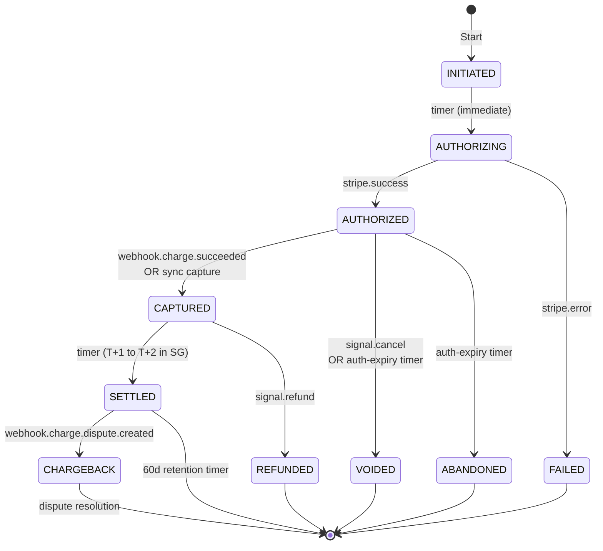
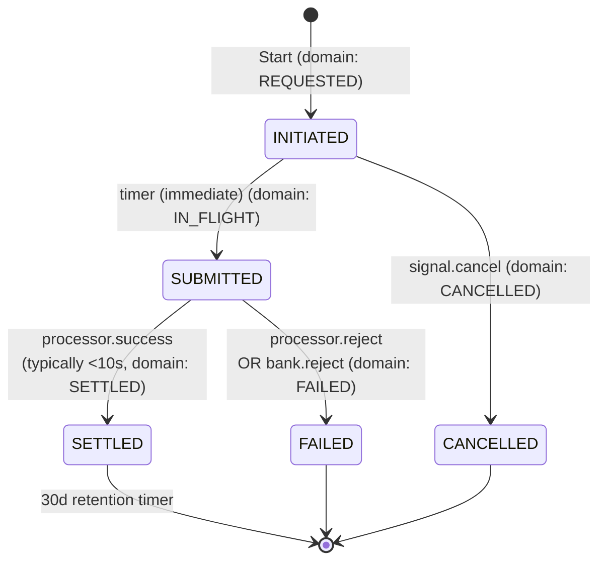
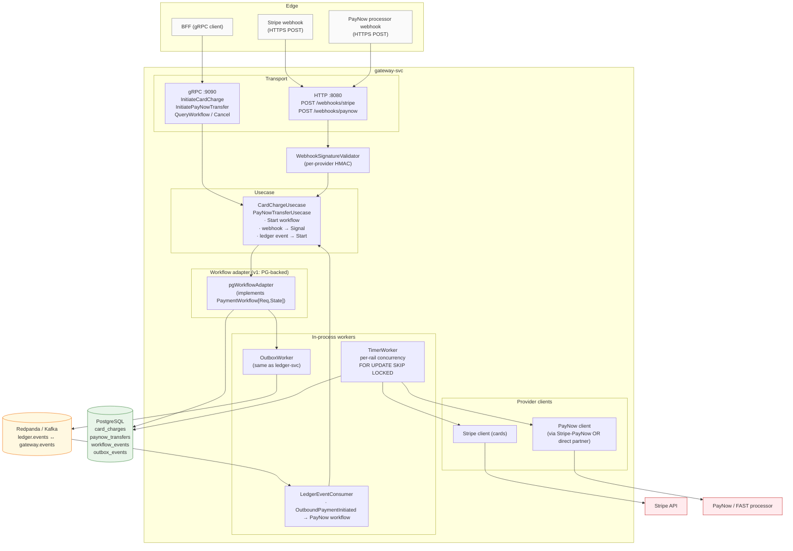

# gateway-svc — charter and v1 design (SEA-first)

This is a **planning doc**, not a description of shipped code. As of
HEAD, `apps/gateway-svc/` is a domain-layer scaffold (interface +
state machines for card-in / one bank-out rail). This doc names what
gateway-svc should be, sets the regional strategy (SEA-first,
Singapore beachhead), sketches the v1 design, and analyzes the v2
workflow-engine options (Temporal, Restate, others) with a
recommendation.

## Charter — purpose

gateway-svc is the **outbound and external-integration boundary** of
the platform. Its job is to keep ledger-svc clean of every messy
external concern (provider APIs, webhook signatures, settlement
windows, PCI scope, sanctions screens, cross-border FX) while still
letting money move in and out of the system durably.

```
inbound (client → us)         outbound (us → external)
    ┌──────────┐                    ┌──────────────┐
    │   BFF    │                    │ gateway-svc  │
    │  (GQL)   │                    │   (gRPC)     │
    └────┬─────┘                    └──────┬───────┘
         │                                 │
         │       ┌──────────────────┐      │
         └──────▶│   ledger-svc     │◀─────┘
                 │  (gRPC, books)   │
                 └──────────────────┘
                  internal source of truth
                  rail-agnostic; knows nothing about
                  Stripe / PayNow / NAPAS / MoMo
```

ledger-svc is the **internal** source of truth — accounts, transfers,
journal entries. Knows nothing about specific payment rails by design.

gateway-svc is the **external boundary** — knows everything about
regional rails, processors, e-wallets, and translates between their
world and ours.

### What gateway-svc owns

1. **Outbound payment execution** — withdrawals, disbursements,
   payouts. Picks the right rail by country/currency/cost, tracks
   the per-rail state machine, publishes settlement events back to
   ledger-svc.
2. **Inbound payment reception** — deposits, funding, top-ups.
   Receives webhooks, validates signatures, normalizes payloads,
   publishes `FundsArrived` events for ledger-svc to consume.
3. **Per-region rail catalog** — which rails are available where,
   with what timing, what fees, what regulatory constraints.
4. **PCI / regulatory scope isolation** — only service that touches
   raw card data (always tokenized via processor); the boundary for
   regional licensing (MAS / SBV / OJK / BoT / BSP).

### What gateway-svc does NOT own

- **No internal account state.** Balances, journal entries — all in
  ledger-svc.
- **No client-facing API.** Clients call BFF; BFF calls gateway-svc.
- **No business policy.** Limits, fees, fraud rules, KYC outcomes
  live in dedicated services.
- **No reconciliation source-of-truth.** Reconciliation happens at
  the ledger level using both sides' data.

### Integration model

Same outbox pattern as ledger-svc internally. Two-way:

```
ledger-svc → outbox → Kafka topic ledger.events  → gateway-svc consumes
gateway-svc → outbox → Kafka topic gateway.events → ledger-svc consumes
```

Loose coupling — either service can be down without corrupting the
other's state. Both consume idempotently.

### Storage isolation — gateway-svc owns its own Postgres

gateway-svc does NOT share a database with ledger-svc. Each service
runs against its own PG cluster (`ledger-db` and `gateway-db` in
docker-compose; separate clusters in production). Five reasons in
priority order:

1. **DDD bounded-context isolation.** ledger-svc owns the
   journal/transactions/audit aggregate; gateway-svc owns the
   card-charges/outbound-transfers/workflow-events aggregate.
   Different bounded contexts → different storage. Sharing a DB is
   the classic "microservices-shaped monolith" anti-pattern — looks
   distributed, coupled at the schema in practice.

2. **Failure isolation.** A runaway gateway query (long SELECT over
   a 7-day card-charge window, autovacuum storm on
   `workflow_events`) shouldn't be able to fill `pg_stat_activity`,
   exhaust connections, or trigger I/O storms that affect
   ledger-svc's hot path. Separate PG instances put a real fence
   between the failure domains.

3. **Independent scaling and tuning.** ledger-svc wants 4GB+
   `shared_buffers`, `synchronous_commit=on`, aggressive autovacuum
   on `journal_entries` / `outbox_events`. gateway-svc wants longer
   `statement_timeout` (waiting on processor APIs), looser
   autovacuum (lower churn), `work_mem` tuned for analytical reads
   on `workflow_events`. These are mutually exclusive on one
   cluster.

4. **Schema autonomy.** Each service's migrations land independently;
   neither team needs sign-off from the other. Separate migration
   directories already exist (`apps/<svc>/migrations/`); the right
   design has them target different DBs, not different schemas in
   the same DB.

5. **PCI / regulatory blast radius.** If gateway-svc ever holds
   card-related data (even tokenized PANs from a processor with
   loose tokenization), the auditor's question is "show me
   everything that database touches." Cleaner answer when the DB
   only contains gateway-svc's tables. ledger-svc stays out of PCI
   scope by construction.

#### What stays shared

Not everything splits. The boundary is "stateful storage that holds
your domain aggregates is yours; the bus between services is shared":

| Resource | Per-service or shared | Why |
|---|---|---|
| **Postgres** | per-service | the bounded-context aggregate lives here |
| **Redis** (idempotency / cache) | per-service keyspaces (shared cluster OK with prefix) | each service has its own keys; namespace by prefix |
| **Kafka / Redpanda** | shared cluster, distinct topics | the inter-service bus by definition |
| **OTel collector** | shared | observability is cross-cutting |
| **Metrics listener** | per-service (different ports) | already is |

#### Connection coords

Each service's `internal/config/config.go` reads from its own struct
tags — Go's `internal/` rule prevents sharing the config package
across `apps/`. So:

```go
// apps/ledger-svc/internal/config/config.go
URL string `env:"LEDGER_DATABASE_URL,required"`

// apps/gateway-svc/internal/config/config.go (future)
URL string `env:"GATEWAY_DATABASE_URL,required"`
```

Root `.env` (or per-service `.env` — see env.example) lists both
URLs. They point at different PG instances on different ports
(`:5432` and `:5433` in dev compose).

## Regional strategy — SEA-first

Three things make SEA payments structurally different from US:

1. **Real-time is the norm, not the exception.** SEA leapfrogged the
   slow batched-ACH era. Most domestic rails settle in seconds:
   Vietnam **NAPAS 247**, Singapore **PayNow / FAST**, Thailand
   **PromptPay**, Malaysia **DuitNow**, Indonesia **BI-FAST**,
   Philippines **InstaPay**.
2. **E-wallets are co-equal with banks, often dominant.** Vietnam:
   MoMo, ZaloPay, VNPay, Viettel Money. Indonesia: GoPay, OVO, DANA,
   ShopeePay. Singapore: GrabPay. Philippines: GCash, Maya. Thailand:
   TrueMoney, Rabbit LINE Pay. In Indonesia and Vietnam, e-wallets
   handle more retail volume than cards.
3. **QR-code payment is a primary UX, not a niche.** QRIS (ID),
   VietQR (VN), PromptPay QR (TH), PayNow QR (SG), DuitNow QR (MY),
   QR Ph (PH) — inter-bank, real-time, customer-initiated.

This collapses the state-machine work compared to ACH. A US ACH-out
needs `INITIATED → SUBMITTED → PENDING → SETTLED` with multi-day
timers and a `RETURNED` terminal. Singapore PayNow / Vietnam NAPAS
collapse to `INITIATED → SUBMITTED → SETTLED` in seconds — three
states, no PENDING window, no return-window timer.

### Market sequencing

**v1: Singapore beachhead.** Smallest regulatory and operational
friction surface; canonical SEA fintech entry market.

| Reason | Why it matters |
|---|---|
| English-speaking, MAS sandbox-friendly | Faster regulatory iteration |
| MPI license path is well-trodden (PSA 2019) | Predictable timeline |
| Stripe + Adyen both fully operational | Card processing is solved |
| PayNow is mature, near-universal, near-free | Outbound rail is solved |
| SGD is stable + freely convertible | No multi-currency complexity in v1 |
| Common SEA-targeting beachhead (Wise, Aspire, Airwallex) | Architectural lessons generalize |

**v2: Vietnam + multi-country aggregator.** Where the volume is.

- **Vietnam direct integration** — bigger market (100M+), but needs a
  Vietnamese legal entity + SBV intermediary payment service license,
  partnerships with local processors (VNPAY, Onepay, 2C2P, Payoo for
  cards; MoMo / ZaloPay / VNPay for e-wallets), real-time bank rail
  via NAPAS 247.
- **Multi-country aggregator** (Xendit is the realistic pick;
  alternatives: dlocal, Adyen, Airwallex) — covers Indonesia,
  Philippines, Thailand, Malaysia under one integration. Trades
  ~1 % extra fees for one relationship instead of five.

**v3+: Per-country direct integrations** in volume-justified markets.
Indonesia is the obvious next direct after Vietnam.

**Not in scope (probably ever):** US. ACH state machine is parked in
the codebase as future-proofing only; the slow batched US rails are
not where this product is going.

## v1 scope (Singapore-shaped, deliberately narrow)

The trap with "payments gateway" is going broad too fast. v1 is:

1. **One country**: Singapore.
2. **One currency**: SGD.
3. **One inbound rail**: Stripe Cards (cards-in for funding).
4. **One outbound rail**: PayNow / FAST (real-time bank-out for
   withdrawals).
5. **PG-backed state machine** behind a swappable workflow interface.
6. **Webhook receiver** with signature validation + dedup.
7. **Outbox + Kafka** topic for events going back to ledger-svc.
8. **Kafka consumer** for `ledger.events` (PayNow-out is initiated
   this way).

Provider routing, failover, e-wallets, multi-country, FX, QR
inbound — all v2+. A working single-rail-per-direction gateway in
Singapore is more useful than a half-built multi-country one.

## v1 design — workflow interface

The interface is the moat. Designed so v2 can swap the implementation
to Temporal / Restate / whatever, AND so adding a new rail (Vietnam
NAPAS, MoMo e-wallet, QRIS) doesn't change the interface — just adds
a new `WorkflowKind` + per-rail state enum.

### Layering — domain vs infrastructure

The domain layer expresses the **business concept** of a flow. It
does NOT name concrete rails. "Card charging" is a domain category
(applies to Stripe, Adyen, 2C2P alike); "outbound bank transfer" is
a domain category (applies to PayNow, NAPAS, ACH, SEPA alike).

Concrete rails (PayNow, NAPAS, ACH) live in `internal/infrastructure`
as adapters. Each adapter implements a domain-level
`PaymentWorkflow[Req,State]` and translates between its rail's
internal sub-states and the domain-level state enum.

```
internal/domain/                       internal/infrastructure/
├─ workflow.go                         ├─ paynow_adapter.go      ─┐
├─ card_charge.go                      ├─ napas_adapter.go         │ each implements a
├─ outbound_bank_transfer.go           ├─ ach_adapter.go (parked)  │ domain workflow
└─ ...                                 ├─ stripe_card_adapter.go ─┘
                                       └─ ...
```

This keeps the domain rail-agnostic — adding Vietnam NAPAS or US
ACH in the future is a new infrastructure adapter, not a new domain
file. The domain doesn't care that PayNow has 5 internal states and
ACH has 7; the adapter maps both to the domain's six-state abstract
machine.

### Domain types (scaffolded)

```go
// internal/domain/workflow.go

// WorkflowKind enumerates BUSINESS-LEVEL categories — not concrete
// rails. Adding a new rail under an existing category does NOT add
// a new kind here.
type WorkflowKind string

const (
    WorkflowKindCardCharge           WorkflowKind = "card_charge"
    WorkflowKindOutboundBankTransfer WorkflowKind = "outbound_bank_transfer"
    // v2 additions (genuinely new categories, not new rails):
    // WorkflowKindEWalletCharge   — MoMo / GrabPay / GoPay / DANA / OVO …
    // WorkflowKindQRPayment       — PayNow QR / VietQR / QRIS / PromptPay QR …
)

type WorkflowID struct {
    Kind WorkflowKind
    ID   uuid.UUID
}

// PaymentWorkflow is the implementation seam — same shape regardless
// of rail. Type parameters carry the per-kind request and state.
type PaymentWorkflow[Req, State any] interface {
    Start(ctx context.Context, req Req) (WorkflowID, error)
    Signal(ctx context.Context, id WorkflowID, ev Event) error
    Query(ctx context.Context, id WorkflowID) (Snapshot[State], error)
    Cancel(ctx context.Context, id WorkflowID, reason string) error
}
```

Shipped in `internal/domain/workflow.go`. The interface is
rail-agnostic — adding NAPAS or MoMo in v2 means a new
infrastructure adapter, not a domain change.

### Per-kind concretizations — v1

```go
// internal/domain/card_charge.go (already shipped)

type CardChargeRequest struct {
    TenantID         string
    IdempotencyKey   string
    UserAccountID    uuid.UUID
    Amount           Amount
    Currency         Currency  // SGD for v1
    PaymentMethodTok string    // Stripe pm_*
    LedgerTransferID *uuid.UUID
}

type CardChargeState string

const (
    CardChargeInitiated   CardChargeState = "INITIATED"
    CardChargeAuthorizing CardChargeState = "AUTHORIZING"
    CardChargeAuthorized  CardChargeState = "AUTHORIZED"
    CardChargeCaptured    CardChargeState = "CAPTURED"
    CardChargeSettled     CardChargeState = "SETTLED"      // T+1 to T+2 in SG via Stripe
    CardChargeFailed      CardChargeState = "FAILED"
    CardChargeVoided      CardChargeState = "VOIDED"
    CardChargeRefunded    CardChargeState = "REFUNDED"
    CardChargeChargeback  CardChargeState = "CHARGEBACK"
    CardChargeAbandoned   CardChargeState = "ABANDONED"
)

type CardChargeWorkflow = PaymentWorkflow[CardChargeRequest, CardChargeState]
```

```go
// internal/domain/outbound_bank_transfer.go — rail-agnostic.

type OutboundBankTransferRequest struct {
    TenantID         string
    IdempotencyKey   string
    UserAccountID    uuid.UUID
    LedgerTransferID uuid.UUID
    Amount           Amount
    Currency         Currency       // SGD for v1
    Country          string         // ISO-3166: 'SG' for v1; drives rail selection
    Destination      OutboundDestination
}

type OutboundDestination struct {
    Kind  string  // e.g. 'paynow_proxy', 'bank_account', 'napas_account', 'iban'
    Token string  // tokenized recipient identifier; opaque from domain POV
}

// Six abstract states. Rail adapters map their internal sub-states
// to these (PayNow's INITIATED/SUBMITTED collapse to REQUESTED/IN_FLIGHT;
// ACH's PENDING extends IN_FLIGHT; ACH's RETURNED maps to REVERSED).
type OutboundBankTransferState string

const (
    OutboundRequested  OutboundBankTransferState = "REQUESTED"
    OutboundInFlight   OutboundBankTransferState = "IN_FLIGHT"
    OutboundSettled    OutboundBankTransferState = "SETTLED"
    OutboundReversed   OutboundBankTransferState = "REVERSED"
    OutboundFailed     OutboundBankTransferState = "FAILED"
    OutboundCancelled  OutboundBankTransferState = "CANCELLED"
)

type OutboundBankTransferWorkflow = PaymentWorkflow[
    OutboundBankTransferRequest, OutboundBankTransferState]
```

Rail-specific state machines (PayNow's 5 internal states, ACH's 7
internal states with PENDING/RETURNED) live in the infrastructure
adapter that implements OutboundBankTransferWorkflow — NOT in the
domain. Adding NAPAS or SEPA in v2 means a new adapter file in
`internal/infrastructure/`, not a new domain file.

### State transitions

Card charge (Stripe, SG):



Outbound bank transfer — **domain-level** abstract state machine
(rail-agnostic; visible to callers via `Snapshot.State`):

```mermaid
stateDiagram-v2
    [*] --> REQUESTED: Start
    REQUESTED --> IN_FLIGHT: adapter.submit
    REQUESTED --> CANCELLED: signal.cancel
    REQUESTED --> FAILED: validation.reject
    IN_FLIGHT --> SETTLED: rail.confirm
    IN_FLIGHT --> FAILED: rail.reject
    SETTLED --> REVERSED: rail.return<br/>(ACH-style; not used by real-time rails)
    SETTLED --> [*]: retention timer
    REVERSED --> [*]
    FAILED --> [*]
    CANCELLED --> [*]
```

PayNow / FAST adapter — **infra-level** internal state machine that
drives the domain abstraction (Singapore v1):



The PayNow adapter has 5 internal states; the domain only sees the
6-state abstraction. ACH (parked) would have 7 internal states with
PENDING and RETURNED but still map to the same 6 domain states. The
abstraction is the moat — adding NAPAS or SEPA later means another
infra adapter, not a domain change.

## v1 design — schema

Each infrastructure adapter owns its own table. The schema is an
INFRA concern — different rails store different things and have
different state shapes. The domain layer doesn't see SQL; it sees
`PaymentWorkflow[Req,State]`.

Per-adapter tables (each owned by the corresponding adapter in
`internal/infrastructure/`):

- `card_charges` — owned by Stripe card adapter (or future Adyen/2C2P)
- `paynow_transfers` — owned by Singapore PayNow adapter
- (v2) `napas_transfers` — owned by Vietnam NAPAS adapter
- (v2) `momo_charges` / `gopay_charges` / etc. — owned by per-e-wallet adapters

All adapters publish into the **shared** `outbox_events` and append
to the shared `workflow_events` audit log. Those two are
domain-level concerns (any adapter writes audit + outbox the same
way) and live alongside the per-adapter tables in the same migrations.

### Migrations

`migrations/001_init_gateway.up.sql` (sketch):

```sql
-- Card charges (Stripe in, Singapore v1).
CREATE TABLE card_charges (
    id                   UUID            PRIMARY KEY DEFAULT uuidv7(),
    tenant_id            VARCHAR(128)    NOT NULL,

    -- correlation
    user_account_id      UUID            NOT NULL,
    idempotency_key      VARCHAR(255)    NOT NULL,
    ledger_transfer_id   UUID,

    -- money
    amount               NUMERIC(19, 4)  NOT NULL,
    currency             VARCHAR(3)      NOT NULL,         -- 'SGD' for v1

    -- provider
    provider             VARCHAR(40)     NOT NULL,         -- 'stripe' for v1
    payment_method_tok   VARCHAR(255)    NOT NULL,         -- pm_* token only
    provider_ref         VARCHAR(255),                     -- stripe charge_id
    provider_error_code  VARCHAR(80),
    provider_error_msg   TEXT,

    -- state machine
    state                VARCHAR(40)     NOT NULL
                                         CHECK (state IN (
                                             'INITIATED','AUTHORIZING','AUTHORIZED',
                                             'CAPTURED','SETTLED',
                                             'FAILED','VOIDED','REFUNDED',
                                             'CHARGEBACK','ABANDONED'
                                         )),
    state_changed_at     TIMESTAMPTZ     NOT NULL DEFAULT NOW(),
    next_action_at       TIMESTAMPTZ,
    next_action          VARCHAR(40),
    next_action_attempts INT             NOT NULL DEFAULT 0,

    created_at           TIMESTAMPTZ     NOT NULL DEFAULT NOW(),
    updated_at           TIMESTAMPTZ     NOT NULL DEFAULT NOW(),

    CONSTRAINT card_charges_tenant_idem UNIQUE (tenant_id, idempotency_key)
);

CREATE INDEX idx_card_charges_next_action
    ON card_charges (next_action_at)
    WHERE next_action_at IS NOT NULL;

CREATE INDEX idx_card_charges_provider_ref
    ON card_charges (provider, provider_ref)
    WHERE provider_ref IS NOT NULL;

-- PayNow / FAST transfers (out, Singapore v1).
CREATE TABLE paynow_transfers (
    id                       UUID            PRIMARY KEY DEFAULT uuidv7(),
    tenant_id                VARCHAR(128)    NOT NULL,

    user_account_id          UUID            NOT NULL,
    idempotency_key          VARCHAR(255)    NOT NULL,
    ledger_transfer_id       UUID            NOT NULL,         -- always pre-debited

    amount                   NUMERIC(19, 4)  NOT NULL,
    currency                 VARCHAR(3)      NOT NULL,         -- 'SGD'

    provider                 VARCHAR(40)     NOT NULL,         -- 'stripe-paynow' | 'direct' | partner
    destination_proxy        VARCHAR(64)     NOT NULL,         -- the PayNow proxy value
    destination_proxy_kind   VARCHAR(16)     NOT NULL
                                             CHECK (destination_proxy_kind IN
                                                 ('nric','uen','mobile','vpa')),
    provider_ref             VARCHAR(255),
    failure_reason_code      VARCHAR(40),                      -- normalized rejection code
    failure_reason_msg       TEXT,

    state                    VARCHAR(40)     NOT NULL
                                             CHECK (state IN (
                                                 'INITIATED','SUBMITTED','SETTLED',
                                                 'FAILED','CANCELLED'
                                             )),
    state_changed_at         TIMESTAMPTZ     NOT NULL DEFAULT NOW(),
    next_action_at           TIMESTAMPTZ,
    next_action              VARCHAR(40),
    next_action_attempts     INT             NOT NULL DEFAULT 0,

    created_at               TIMESTAMPTZ     NOT NULL DEFAULT NOW(),
    updated_at               TIMESTAMPTZ     NOT NULL DEFAULT NOW(),

    CONSTRAINT paynow_transfers_tenant_idem UNIQUE (tenant_id, idempotency_key)
);

CREATE INDEX idx_paynow_transfers_next_action
    ON paynow_transfers (next_action_at)
    WHERE next_action_at IS NOT NULL;

-- workflow_events, outbox_events: same shape as in the previous draft.
-- Audit log + dedup on (source, external_event_id) UNIQUE.
```

### Why per-rail tables, not one generic `payment_workflows` table

Same reasoning as before, plus an SEA-specific reason: each rail's
state shape is materially different (PayNow 5 states, NAPAS 5 states,
ACH 7 states, e-wallet probably 4–6 states with different terminals).
A generic `state VARCHAR` collapses these into a soup; per-rail tables
keep the CHECK constraint expressive and the query plans clean.

When v2 adds NAPAS / e-wallets / QR rails, each gets its own table.
Migration of one rail to v2 (Temporal) doesn't disturb others.

## v1 design — components



Component breakdown is unchanged in shape from the previous draft —
same transport layer, same webhook validator, same usecase split, same
adapter/poller/outbox topology. Only the providers and rail names
change.

### Operational notes

- **Same env / config / observability shape as ledger-svc.** Reuse
  `internal/config`, `internal/observability`, `internal/transport/grpc/interceptors`.
- **Two pgxpools** like ledger-svc: requestPool for gRPC handlers,
  workerPool for TimerWorker + OutboxWorker + LedgerEventConsumer.
- **Reconciler additions** for stuck-workflow sweeps:
  - "card charges in AUTHORIZED for > 7 days" → page (Stripe SG
    capture window)
  - "PayNow transfers in SUBMITTED for > 5 min" → page (real-time
    rail; should be SETTLED or FAILED in seconds)
  - "outbox event hasn't published in > 5 min" → standard
- **PCI scope.** v1 takes payment method tokens only (Stripe `pm_*`),
  never raw PAN. PayNow uses bank proxies (NRIC/UEN/mobile/VPA) which
  are PII but not PCI.
- **MAS data residency.** Singapore data residency requirements may
  require PG to be hosted in SG region. Confirm with compliance
  before deployment topology is fixed.

## v1 — what's deferred

| Item | Why deferred |
|---|---|
| E-wallet integrations (GrabPay, MoMo, GoPay) | Not the dominant rail in SG; primary rail when expanding to VN/ID/PH. v2. |
| Multi-rail per-direction (e.g., DBS direct + PayNow + GrabPay for outbound) | One rail per direction is enough for v1. |
| Provider routing / failover | One processor is enough for v1. |
| QR-code inbound (PayNow QR / VietQR / QRIS) | Customer-initiated flow; different UX surface; v2. |
| Cross-border / FX | Adds rate sourcing + locking subsystem. v2 when expanding to VN. |
| Bulk / batch payouts | Per-tx is the simpler path. |
| Saga compensations across providers | v2 when multi-rail lands. |
| Card vault / PCI tokenization | Defer to processor's vault; don't build our own. |
| US ACH | Not in scope. `internal/domain/ach_transfer.go` parked as future-proofing only. |

## v2 — geographic expansion

When v1 is operationally proven in Singapore, v2 expands to the rest
of SEA. Two parallel tracks:

### Track A — Vietnam (direct integration)

Where the volume is, but materially harder. v2 work:

1. **Vietnamese legal entity + SBV intermediary payment service license.**
   Months of paperwork. Engineering can proceed in parallel against
   sandbox APIs.
2. **VND currency support.** Multi-currency Money type promotes from
   `string` to `apd.Decimal`-backed; rate sourcing for SGD↔VND if
   cross-border flows are in scope.
3. **MoMo / ZaloPay e-wallet integration.** New `WorkflowKind`,
   typically OAuth-style customer-redirect flow + webhook for
   completion. State shape:
   ```
   INITIATED → REDIRECTED → AUTHORIZED → CAPTURED → [SETTLED]
                          → FAILED / EXPIRED
   ```
4. **NAPAS 247 outbound** (real-time bank-to-bank in VN). State shape
   is similar to PayNow — `INITIATED → SUBMITTED → SETTLED + FAILED +
   CANCELLED`.
5. **VietQR inbound** (customer scans QR, push payment lands as
   webhook). Different state machine: workflow waits in
   `AWAITING_CUSTOMER_SCAN` for a TTL, then SETTLED on webhook or
   EXPIRED on timeout.
6. **Local card processor** for VN cards (international Visa/MC
   cards work via Stripe in some VN merchants but issuance differs;
   local processors like VNPAY / 2C2P / Onepay handle domestic card
   schemes).

Estimated scope: 4–6 months of focused work, gated on entity +
license arrival.

### Track B — multi-country aggregator (Indonesia / Philippines / Thailand / Malaysia)

Use a single multi-country aggregator (Xendit is the realistic v2
default; alternatives: dlocal, Adyen, Airwallex) to cover the rest of
SEA without per-country direct deals. Trades ~1 % fee margin for one
integration relationship.

What this looks like in our architecture:

- **One new `WorkflowKind` per category** (e.g.,
  `WorkflowKindAggregatorCharge`, `WorkflowKindAggregatorPayout`)
  that encodes the cross-country state machine the aggregator
  exposes — usually similar shape to a card charge with country +
  rail selection metadata.
- **Aggregator's status notifications** flow through their unified
  webhook endpoint; gateway normalizes into our `Event` envelope.
- **Cost / latency / coverage trade-off** noted explicitly: an
  aggregator gives us reach faster than direct integration but at
  higher unit cost and less control over routing.

Estimated scope: 6–8 weeks for the aggregator integration; covers
4–5 SEA markets.

### Track C — direct per-country (post-aggregator)

When per-country volume justifies the work, replace aggregator legs
with direct integrations market by market. Indonesia is the obvious
next direct after Vietnam (largest SEA market, most volume).

### Out of scope (per current plan)

- US (ACH, RTP, FedNow). Codebase has the ACH state-machine pattern
  parked as reference; not implementing.
- EU (SEPA Credit Transfer, SEPA Instant). Different regulatory
  regime; revisit if EU expansion ever lands.
- China (CNAPS, WeChat Pay, Alipay). Significantly different
  regulatory + technical environment; standalone project if pursued.

## v2 — workflow engine evaluation

The workflow-engine choice is **independent of geographic expansion**.
The `PaymentWorkflow[Req,State]` interface stays the same whether
we're driving PayNow, NAPAS, MoMo, or QRIS — only the implementation
(PG-backed in v1) changes.

This section is the analysis: when to migrate the implementation
from PG-backed state machines to a workflow engine, what to migrate
to, and why.

### When to even consider migration

Don't migrate on principle. Migrate when at least one is true and
measured:

1. **3+ rails with materially different timing.** Once we have
   PayNow + NAPAS + MoMo + Stripe Cards + QRIS, each with its own
   state machine + retry policy + webhook shape, the polling worker
   becomes a fleet and saga patterns emerge. At that scale the
   hand-rolled-PG approach starts looking like a poorly-implemented
   workflow engine. v2 expansion will hit this — likely 12–18
   months out from v1 ship.
2. **Real saga / compensation patterns.** Multi-step flows where
   step 3 failure has to roll back steps 1 and 2 across different
   rails. Encoding in PG state-tables is doable but error paths get
   fiddly.
3. **In-flight workflow count > ~10K active.** Polling workers
   degrade gracefully but the queueing latency starts to show.
4. **Workflow-level observability that wants a UI.** "Where is this
   transaction stuck?" answered by Temporal Web for free.
5. **Workflow versioning becomes an active concern.** When you have
   100K workflows mid-flight and need to deploy a code change to
   workflow logic.

If none of those are biting, **stay on PG.** Migration cost is real.

### Options

#### Option A — Temporal (Cloud or self-hosted)

The de facto Go workflow engine. Forked from Cadence (Uber). Used by
Stripe, Snap, Coinbase, Datadog.

**Pros:** most production-hardened option; Go SDK is first-class;
workflow history is a complete audit trail; mature versioning;
Temporal Cloud removes self-host operational burden.

**Cons:** heavy ops if self-hosted (4 service types + persistence);
determinism rules in workflow code; cost (Temporal Cloud is
~$1–5K/month at startup scale).

**For SEA expansion:** Temporal Cloud is available in Asia regions
(Tokyo, Sydney) — latency from SG/VN is ~50–100ms, acceptable for
workflow orchestration. Confirm data residency requirements with
MAS / SBV before committing.

#### Option B — Restate

Newer (2023+). Single-binary, lighter than Temporal.

**Pros:** much lighter ops; HTTP-based invocation model; workflow
code closer to "normal Go"; modern design.

**Cons:** smaller community; production deployments at fintech
scale not yet public; less mature ecosystem; HTTP invocation has
slightly more overhead.

**For SEA expansion:** less production-proven for money movement.
Risk of betting on a younger project for a regulated workload.

#### Option C — DBOS

Postgres-native durable execution. Very new.

**For SEA expansion:** keep watching, defer 12–18 months.

#### Option D — AWS Step Functions / GCP Workflows / Azure Durable

Cloud-managed. Cloud lock-in.

**For SEA expansion:** AWS has Singapore + Jakarta regions; GCP has
Singapore + Jakarta + Tokyo. Latency fine. But cloud lock-in is
expensive for a money-moving subsystem we want full control of.
Skip unless cloud strategy locks us in.

#### Option E — Inngest

JS/TS-native; Go SDK secondary. Skip.

#### Option F — Stay on PG state machine

The honest "do nothing" option. Often right for a long time.

### Comparison summary

| Option | Ops cost | Production maturity | Go-native | Vendor risk | Right when |
|---|---|---|---|---|---|
| **A. Temporal Cloud** | Low ($) | Very high | Yes | Low | 3+ rails, growing scale, can pay |
| A'. Temporal self-host | High | Very high | Yes | Low | 3+ rails, have SRE budget |
| **B. Restate** | Low | Medium | Yes | Medium | want lighter, willing to bet younger |
| C. DBOS | Very low | Low | Yes | High | reconsider in 12–18 months |
| D. Step Functions | None | High | OK | High (cloud lock-in) | already deep in AWS |
| E. Inngest | Low–Med | Medium | OK (secondary) | Medium | JS/TS-heavy stack (we're not) |
| **F. Stay on PG** | None new | High (we built it) | Native | None | as long as triggers don't fire |

### Recommendation

**v1: Stay on PG state machine.** Build the design above.

**v2 (when triggers fire — likely at 3rd or 4th rail): Temporal
Cloud.**

Rationale: production maturity matters most for a money-moving
subsystem; Temporal has 5+ years of production hardening at scale;
Go-native first-class; Cloud removes self-host ops; workflow history
as audit trail is a real bonus for MAS / SBV compliance posture.

**Restate is the runner-up.** Re-evaluate annually. If by 2027 it
has 2+ public production fintech deployments at our scale, becomes a
serious contender.

**DBOS** — re-evaluate in 12–18 months.

### Migration plan if we go Temporal

Phased; the `PaymentWorkflow` interface stays constant throughout.

1. **Phase 1 (1w):** Stand up Temporal Cloud (Tokyo or Sydney
   region). Pilot on a non-critical workflow first.
2. **Phase 2 (2w per rail):** Build per-rail `Temporal*Workflow`
   adapters implementing `PaymentWorkflow[Req,State]`. Run
   side-by-side with PG implementation under feature flag
   (`tenant.use_temporal_<kind>`).
3. **Phase 3 (1w per rail):** Migrate one tenant per rail, watch a
   week, verify history matches.
4. **Phase 4:** Roll to all tenants. Drain PG tables for that rail to
   "no in-flight" before disabling the PG adapter.
5. **Phase 5:** Repeat per-rail.
6. **Phase 6:** Decommission PG state-machine adapter once all rails
   migrated. Keep `workflow_events` audit table.

Total: ~3 weeks per rail × N rails, plus prerequisites. At 4 active
rails (Stripe, PayNow, NAPAS, MoMo) we're looking at ~3–4 months.

## What stays unchanged regardless of v2 / regional expansion

- `PaymentWorkflow[Req,State]` interface contract.
- Per-rail state enums + transition predicates (state machine logic
  lives in `internal/domain/<rail>.go` and is region/engine-agnostic).
- Webhook signature validation pattern (always at HTTP boundary).
- Outbox + Kafka topic for events back to ledger-svc.
- Tokenized payment methods only; never raw PAN.
- Reconciler-style stuck-workflow sweeps.

## Open questions

Before scaffolding more code:

1. **Confirm Singapore as v1 market.** Vs Vietnam-first or
   multi-country-via-aggregator-first.
2. **Currency scope for v1.** SGD only, or SGD + USD (some SG
   fintechs serve cross-border use cases)?
3. **Card processor for SG: Stripe vs Adyen.** Stripe is the
   default; Adyen has stronger SEA-wide coverage if we want one
   processor across SG + future markets.
4. **PayNow processor: via Stripe (Stripe-PayNow), via Adyen, or
   direct via a SG bank partner (DBS, OCBC, UOB)?** Direct is more
   work but cheaper and gives more control; via Stripe is faster.
5. **MAS license status.** MPI license held? Sandbox status?
   Determines what compliance work is required pre-v1.
6. **Webhook receiver placement.** In gateway-svc or a thin
   dedicated service? In-svc is simpler; separate is more PCI-
   isolated if cards expand to non-tokenized in future markets.
7. **gRPC API contract.** BFF expects synchronous (Initiate →
   Snapshot) or async (return WorkflowID, BFF polls)? Likely
   sync-with-timeout for v1.
8. **Audit chain integration.** ledger-svc's per-tenant SHA-256
   chain handles internal events. Should gateway events flow
   through it, or have their own chain? Probably the latter —
   gateway events are about external movements, not ledger postings.

## File map (anticipated, post-rename)

| Concern | Path |
|---|---|
| Domain — workflow interface | `internal/domain/workflow.go` ✓ |
| Domain — card-charging (rail-agnostic) | `internal/domain/card_charge.go` ✓ |
| Domain — outbound bank transfer (rail-agnostic) | `internal/domain/outbound_bank_transfer.go` ✓ |
| Domain — money + currency | `internal/domain/money.go` ✓ |
| Domain — sentinel errors | `internal/domain/errors.go` ✓ |
| Infra — Stripe card adapter (v1) | `internal/infrastructure/stripe_card_adapter.go` |
| Infra — Singapore PayNow adapter (v1) | `internal/infrastructure/paynow_adapter.go` |
| Infra — TimerWorker (per-adapter polling) | `internal/infrastructure/timer_worker.go` |
| Infra — OutboxWorker | `internal/infrastructure/outbox_worker.go` |
| Infra — LedgerEventConsumer | `internal/infrastructure/ledger_event_consumer.go` |
| Infra — webhook signature validators | `internal/transport/http/webhook.go` |
| Usecases | `internal/usecase/card_charge.go`<br/>`internal/usecase/outbound_bank_transfer.go` |
| gRPC server | `internal/transport/grpc/server.go` |
| Migrations | `migrations/001_init_gateway.up.sql` |
| Server binary | `cmd/server/main.go` |
| Reconciler binary | `cmd/reconciler/main.go` |

Future v2 additions — note **no new domain files** for new rails;
each rail is a new infrastructure adapter:

- `internal/infrastructure/napas_adapter.go` — Vietnam bank-out
  (implements `OutboundBankTransferWorkflow`)
- `internal/infrastructure/ach_adapter.go` — US ACH (parked)
- `internal/infrastructure/aggregator_adapter.go` — Xendit / dlocal
  multi-country (implements both card and outbound workflows)

Genuinely new categories (not just new rails) DO get new domain
files in v2:

- `internal/domain/ewallet_charge.go` — MoMo / GrabPay / GoPay etc.
  share an OAuth-redirect + webhook-completion pattern that doesn't
  fit either CardCharge (no auth/capture) or OutboundBankTransfer
  (different direction). Worth its own kind.
- `internal/domain/qr_payment.go` — customer-initiated QR scan
  (PayNow QR / VietQR / QRIS). The "wait for customer to scan"
  state is unique to this category.

## Net

- v1 = Singapore-shaped: Stripe Cards in + PayNow / FAST out, PG-
  backed state machine, single currency (SGD), single processor per
  direction. ~4–6 weeks of focused work.
- The interface (`PaymentWorkflow[Req,State]`) is the moat. It
  accommodates every SEA rail without contract change.
- v2 expansion is geographic (Vietnam direct + multi-country
  aggregator) AND structural (move to Temporal Cloud) — the two
  tracks are independent.
- US is parked. The ACH state-machine pattern stays in the codebase
  as future-proofing reference, not active work.
- Most likely outcome: v1 ships in SG; v2 lands Vietnam + aggregator
  in 6–12 months; Temporal arrives at the 3rd or 4th rail. That's
  the realistic 18-month picture.
