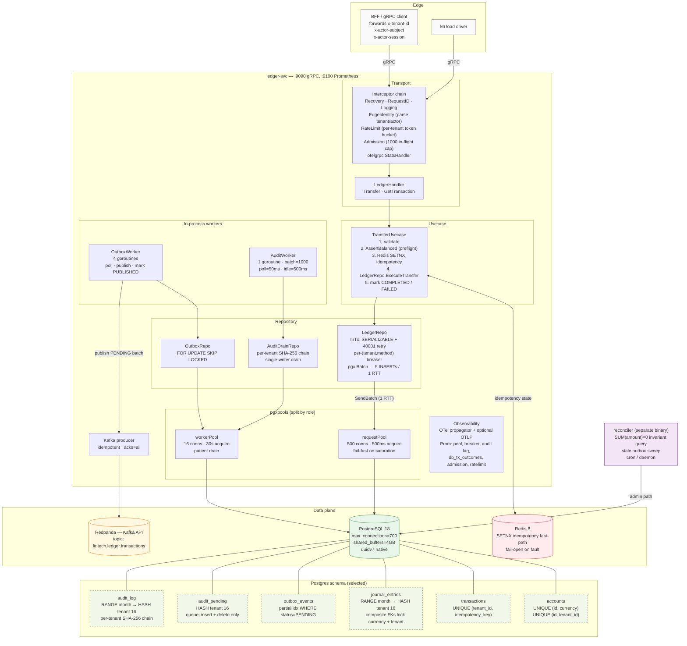
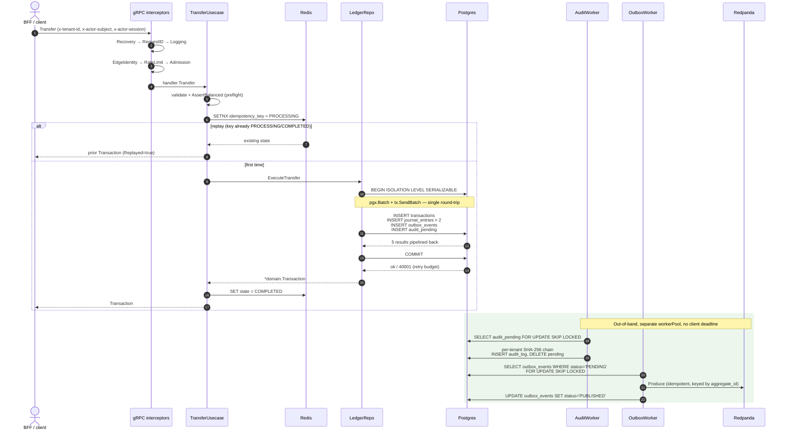

# ledger-svc — architecture (current)

Snapshot of HEAD (`43d86d4`). Reflects what's actually shipped: async
audit, `pgx.SendBatch` on the write path, split request/worker
pgxpools, per-(tenant,method) circuit breaker, Pareto-skewed load
profile validated to ~2.4K sustained TPS at p50=297ms on a
workstation, with the 5K+ project target met on bigger iron.

## System view

## Request hot path — `Transfer` RPC

## Load-bearing invariants

These are enforced by the architecture above; touching any of them
needs the `scaling-roadmap-10k.md` trade-off conversation, not just a
code change.

1. **Double-entry sum-zero.** Every committed transaction's journal
   entries sum to zero. Three layers: `domain.AssertBalanced`
   (preflight), the same assert inside the SERIALIZABLE tx, and the
   reconciler's `SUM(amount)=0` invariant query.
2. **Idempotency.** `transactions.idempotency_key` is composite-UNIQUE
   per tenant. Redis SETNX is the fast-path; on Redis fault the
   usecase fails open and PG's unique constraint catches the
   duplicate.
3. **Atomicity of ledger + outbox + audit_pending.** All five INSERTs
   commit in one Postgres tx. Ledger durability ⟺ outbox event
   durability ⟺ audit row enqueued. The audit *chain* is async (worker
   forwards `audit_pending` → `audit_log`), but the *enqueue* is in
   the same tx — there is no committed ledger row without a queued
   audit row.
4. **Money is `NUMERIC(19,4)`** end-to-end. Wire format is
   decimal-as-string (proto3 `string amount`).
5. **Currency is locked to the account.** Composite FK
   `(account_id, currency) → accounts(id, currency)` makes a
   non-native-currency journal entry unrepresentable.

## Why two pgxpools

Splitting the connection pool by role (`requestPool` vs `workerPool`)
prevents two failure-mode pairs from interfering:

- **Request path saturating starves the workers.** Without a split, a
  request burst at 250–500 conn ceiling would block outbox + audit
  drain on `Acquire`. Result: events back up in `outbox_events` and
  `audit_pending`, audit lag grows, alerts fire — even though PG
  itself is fine.
- **Slow Kafka publish starves the request path.** OutboxWorker holds
  a conn during `ProduceBatch`. If Kafka blips, all 4 workers can hold
  their conns for seconds. With a shared pool, request-path acquires
  start timing out at 500 ms and surface as `ResourceExhausted` to
  callers — cascading a transient Kafka issue into the user-facing
  hot path.

The split costs a few extra connections (`16 + 500` vs `500`) and
keeps each pool's failure mode local.

## Why async audit

Original design had the audit row + per-tenant SHA-256 chain compute
*inside* the SERIALIZABLE request tx. That introduced a per-tenant
read of `MAX(audit_log) WHERE tenant_id=$1` on every commit, which
became the throughput ceiling at ~5K TPS — hot-tenant chain heads
serialized concurrent commits.

Current design: request tx writes a tiny `audit_pending` row (no chain
state). A single-writer `AuditWorker` drains `audit_pending` → chains
SHA-256 → inserts to `audit_log` → deletes the pending row, all in
one READ COMMITTED tx per batch. Single-writer is by design — the
chain head needs a single owner; multi-worker would require an
advisory lock per tenant and we already paid that cost once and
reverted it (commit `5d291e9`).

Trade-off: `audit_log` is no longer atomic with the ledger row.
Bounded operationally by `audit_pending_lag_seconds`; in load tests
the bound has been 0–1 s.

## File map

| Concern | File |
|---|---|
| gRPC server + interceptor wiring | `internal/transport/grpc/server.go` |
| Edge identity, rate limit, admission | `internal/transport/grpc/interceptors/` |
| Usecase orchestration | `internal/usecase/transfer.go` |
| Repository write path (SendBatch) | `internal/repository/ledger_repo.go` |
| Audit drain (worker-side repo) | `internal/repository/audit_drain.go` |
| Audit chain hashing | `internal/audit/hasher.go` |
| Outbox repo | `internal/repository/outbox_repo.go` |
| pgxpool wrapper + retry/breaker | `internal/repository/{pool,tx,retry,breaker}.go` |
| Audit worker loop | `internal/infrastructure/audit_worker.go` |
| Outbox worker loop | `internal/infrastructure/outbox_worker.go` |
| Kafka producer | `internal/infrastructure/kafka_producer.go` |
| Redis idempotency store | `internal/infrastructure/idempotency_redis.go` |
| Domain (entities, ports, sentinel errors) | `internal/domain/` |
| Config (env contract) | `internal/config/config.go` |
| Observability (OTel + Prom) | `internal/observability/` |
| Migrations | `migrations/001_init_ledger.up.sql` `migrations/002_audit_pending.up.sql` |
| Reconciler binary | `cmd/reconciler/main.go` |
| Server binary (DI wiring) | `cmd/server/main.go` |
| Load harness | `cmd/loadtest/` `load/k6/{transfer,transfer-bench}.js` |

## What's not in this picture

- **BFF (GraphQL)** — separate service, will land in front of
  ledger-svc + future gateway-svc. Today direct gRPC clients (k6,
  smoke tests) mint the headers themselves.
- **JWKS-backed JWT verifier** — pending. Today's edge auth trusts
  forwarded headers (`DevTokenVerifier`); production needs a real
  verifier.
- **Multi-replica scale.** Architecture supports it (outbox uses
  `FOR UPDATE SKIP LOCKED`; audit worker singleton stays singleton via
  the chain head ownership invariant), but untested under load.
- **Sharding** (Citus / app-level shard router). The roadmap calls
  this Tier 3 — month-2 territory, only after Tier 4 (isolation
  review) measures out.
