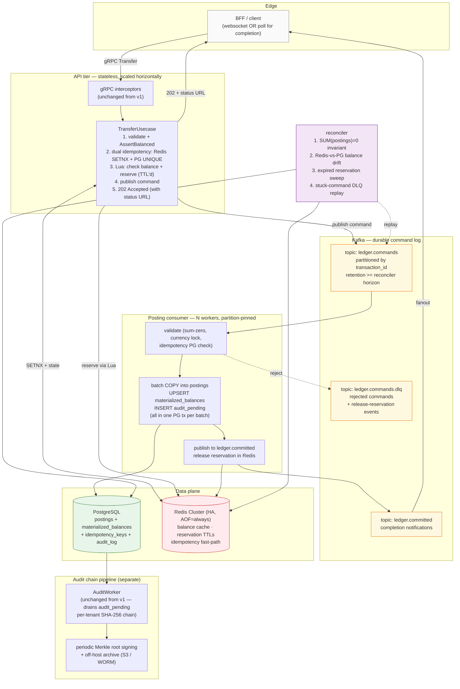

# Scaling v2 — async-commit ledger (10K+ TPS roadmap)

This is the **structural** roadmap. Companion to:

- `scaling-roadmap-10k.md` — incremental tiers (pool tuning, SendBatch,
  isolation drop, sharding) within the current synchronous architecture.
- `architecture.md` — what's shipped today (HEAD = `9ecbdaa`).

The two roadmaps cover different bets:

|  | Incremental (Tier 1–4 in `scaling-roadmap-10k.md`) | This doc (v2) |
|---|---|---|
| Consistency at API | strong (SERIALIZABLE, synchronous) | eventual (async commit, 202) |
| Hardware ceiling | ~10K TPS / single PG | 20–50K / single PG, linear with shards |
| Code change scope | refactors, no contract change | new architecture, new client UX |
| Time to ship | weeks | months |
| When to choose | 5–10K target met, want headroom | 10K target NOT met by Tier 4 + sharding |

Don't start v2 until Tier 4 has been measured. The most expensive
mistake in this category is rewriting before the simpler answer has
been ruled out.

## Target shape

Same external API surface, very different internals. Strong
consistency moves from "before the API responds" to "before the audit
log has been chained" — bounded, but no longer synchronous.



## Trade-off summary

**Gained:**
- Throughput ceiling is no longer one PG's synchronous SERIALIZABLE
  capacity. Per-account-id partitioning with N consumers gives roughly
  N× the apply rate, until PG itself is the bottleneck — then per-
  shard PG (Citus / app-level) is the next move.
- API tier survives PG hiccups. Commands queue in Kafka; user sees
  202; consumer drains when PG returns.
- Natural "rebuild ledger from event log" surface. Disaster recovery
  story is much simpler.

**Given up:**
- Synchronous response with the persisted Transaction. Clients see
  202 + status URL or websocket; they have to wait (typical: 50–
  500ms in healthy state) before "transfer complete" is observable.
- The `ExecuteTransfer` API contract changes. Existing direct gRPC
  callers (smoke, k6) need to follow the status URL; the BFF needs
  to either block on completion or surface "submitted" state to the
  user.
- One more durable system (Kafka) joins the on-call rotation.
- Reconciliation surface grows: not just sum-zero, also "Redis
  balance ≠ PG postings sum", "reservation expired without commit",
  "command in DLQ".

## Phase plan

Each phase is independently shippable and reverts cleanly to the
prior phase. **Don't merge a phase until the prior one has run for at
least a week in production.**

### Phase 0 — measure and decide (week 0)

Run Tier 1 + Tier 2 (already shipped) + Tier 4 (isolation review,
still pending) and re-measure on production-shaped hardware with
off-box k6. Three outcomes:

| Outcome | Action |
|---|---|
| ≥ 10K sustained, p99 < SLO | Stop. v2 is over-engineering. |
| 6–10K, blocked by hot-account contention | v2 may help. Continue. |
| < 6K | Diagnose hardware/PG before assuming v2 fixes it. |

**Exit criterion:** documented "Tier 4 measured at X TPS, blocked by
Y" — not "Tier 4 might help, let's skip to v2."

### Phase 1 — instrument + dual-write (weeks 1–4)

Goal: stand up the Kafka command log alongside the existing
synchronous path, validate that both paths agree, with **zero client
behavior change**.

Concrete work:

1. New topic `ledger.commands` (Redpanda → real Kafka cluster for
   prod). Schema: protobuf, partition key = `transaction_id`. Define
   `TransferCommandV1` with the full envelope (audit identity, fingerprint, etc.).
2. After successful `LedgerRepo.ExecuteTransfer` returns, publish the
   already-committed transaction to `ledger.commands` as a
   `TransferAppliedV1` event. This is just instrumentation —
   downstream consumers can read the log without it being authoritative.
3. Build the **shadow consumer**: reads `ledger.commands`, applies to
   a *separate* `postings_shadow` table via batch COPY, computes a
   shadow balance. Reconciler diff-checks shadow vs primary
   nightly. Catch any encoding/ordering issues before the cutover.
4. Add `materialized_balances` table to current schema, populated by
   triggers on `journal_entries` insert (UPSERT). This becomes the
   read-side surface for `GetBalance` even before v2 cuts over —
   useful in v1 anyway.

**Exit criterion:** shadow ledger matches primary on every row for 7
straight days under production traffic, including a deliberate Kafka
broker failover.

### Phase 2 — introduce reservation Lua + 202 path (weeks 5–8)

Goal: build the reservation path as an *opt-in* alternative to the
synchronous one, behind a per-tenant feature flag.

Concrete work:

1. Redis Cluster with AOF `appendfsync=always` and replication. **No
   AOF gap is acceptable for reservations.**
2. Lua script `reserve.lua`:
   ```
   KEYS = [account_balance_key]
   ARGV = [amount, reservation_id, ttl_ms]
   ```
   Atomically: check balance ≥ amount → decrement → write reservation
   record with TTL. Return reservation_id or "INSUFFICIENT_FUNDS".
3. Cold-start protocol: on Redis cache miss for an account, hot-load
   from `SELECT SUM(amount) FROM journal_entries WHERE account_id=…`
   gated by an advisory lock so two API instances can't double-load.
4. New API path `TransferAsync` — does idempotency + reserve +
   publish to `ledger.commands` + return 202 with status URL.
   `Transfer` (synchronous) keeps working unchanged.
5. Feature flag per tenant in config: `tenant.async_ledger_enabled`.
   Default off. Enable only for tenants who've opted into the new
   client UX.

**Exit criterion:** at least one production tenant running async-only
for 14 days with audit chain still verifying correctly and zero
balance drift between Redis and PG.

### Phase 3 — promote async path to authoritative (weeks 9–14)

Goal: flip the consumer from "shadow" to "source of truth", retire
the synchronous in-tx postings path for opted-in tenants.

Concrete work:

1. Consumer commits postings + `materialized_balances` UPSERT +
   `audit_pending` insert in a single PG tx, using `pgx.SendBatch`
   per batch (multi-row COPY for postings, batched UPSERTs for
   balances). Order is load-bearing: postings before balances before
   audit, so a partial-batch failure leaves a recoverable state.
2. Consumer rejects (sum-zero violation, currency mismatch, idempotency
   collision) write to DLQ + publish a `ReservationReleaseV1` event
   that the API tier consumes to release the Redis reservation.
3. Sync `Transfer` API for async-enabled tenants becomes a thin
   wrapper that internally publishes a command and blocks (with
   timeout) on `ledger.committed` for the corresponding tx. Provides
   a synchronous-shaped response while the underlying path is async.
   Existing clients don't notice.
4. Two-account partition strategy: pick **one** of these and document:
   - **Option A** — partition by `transaction_id`. Lose strict
     per-account ordering across partitions. The consumer enforces
     "no posting before its predecessor on the same account" via a
     per-account watermark in PG. Simpler partition shape; more
     consumer-side bookkeeping.
   - **Option B** — partition by `min(from_account, to_account)`.
     Both legs of any transfer land on the same partition (consistent
     hash). Per-account ordering preserved on the "min side"; the
     "max side" is reconciled separately. Cleaner per-account
     ordering; partition skew if accounts cluster.
   - Default: Option A with watermark. Watermark is a known pattern;
     Option B's partition skew is harder to fix.

**Exit criterion:** all tenants migrated, synchronous path code
deleted, sustained 15K TPS in load test on production hardware with
audit chain verifying.

### Phase 4 — harden (weeks 15+)

Per-event signing, off-host audit archive, replay tooling, drift
auto-repair. Each is a 1–2-week task; ship one at a time.

1. **Audit signing.** Reconciler periodically computes a Merkle root
   over the last N audit_log rows per tenant and writes the signed
   root to S3 + a separate compliance log. Auditor verifies a chain
   by walking forward from the last signed root.
2. **Replay tooling.** `cmd/ledger-replay` — re-applies a Kafka
   command range to a fresh DB, useful for DR drills and debugging.
3. **Drift auto-repair.** When reconciler finds Redis balance ≠
   PG postings sum, emit a `BalanceRepairV1` event consumed by the
   API tier to fix Redis. Manual approval gate above a threshold.
4. **Backpressure.** When consumer lag exceeds threshold, API tier
   stops accepting new `TransferAsync` calls — returns 503 with
   `Retry-After`. Fail-fast over silent unbounded queue growth.

## Load-bearing pieces — explicit handling

These are the items the alternative-design diagram omitted. v2 must
solve each of them.

### Audit chain (tamper evidence)

- Stays as `audit_pending` → `audit_log` worker pipeline. The
  consumer writes one `audit_pending` row per applied transaction in
  the same tx as the postings. Chain is verified the same way
  external auditors verify it today.
- Phase 4 adds Merkle-root signing for stronger non-repudiation.
- **Kafka itself is not the audit log.** Kafka command log is
  retention-bounded and replayable; the audit chain is append-only,
  hash-linked, and signed.

### Sum-zero invariant

- Three layers, same as v1:
  - API tier: `domain.AssertBalanced` preflight on the command.
  - Consumer: re-asserts before COPY. Reject + DLQ on violation.
  - Reconciler: `SUM(postings)=0` invariant query + page on failure.
- Adding async doesn't relax this — the consumer is the new "in-tx
  enforcement" point.

### Durable idempotency

- Dual-layer (matches v1):
  - Redis SETNX in API tier — fast-path, catches 99.99% of replays.
  - PG `idempotency_keys` table with `UNIQUE(tenant_id, idempotency_key)`
    enforced by the consumer at apply time. Catches replays after
    Redis TTL expires.
- API tier never returns "success" for a command that hasn't passed
  PG-side idempotency check — even if it has to wait on the
  consumer's `ledger.committed` notification.

### Reservation lifecycle

- Reservation has TTL (default 30s) in Redis.
- Happy path: consumer applies → publishes `ReservationCommitV1` →
  Redis releases reservation, decrements balance.
- Rejection path: consumer DLQs → publishes `ReservationReleaseV1` →
  Redis releases reservation, restores balance.
- Timeout path: TTL expires before consumer commits → reservation
  evaporates. **The consumer must check the reservation still exists
  before applying.** If not, the command goes to DLQ as
  "RESERVATION_EXPIRED".
- Reconciler sweeps PG-committed transactions and verifies their
  reservations were released; pages on stuck reservations.

### Redis cold-start

- On any account-balance-key miss in Redis, the API tier:
  1. Acquires a per-account advisory lock (via PG or Redis SETNX).
  2. Reads `SELECT balance FROM materialized_balances WHERE account_id=...`.
  3. Writes the cache, releases the lock.
- `materialized_balances` is the durable source of truth for balance
  state at any point in time. Postings are the audit-grade ledger;
  balances are the read-side projection.

### Async client UX

- BFF gets a `TransferStatus` gRPC API: `GET /transfers/{id}` → status
  ∈ `{SUBMITTED, COMMITTED, REJECTED}` + the Transaction once
  available.
- Server-streaming alternative: BFF subscribes to `ledger.committed`
  events for its tenant via gRPC stream.
- For latency-sensitive flows (UI awaits confirmation), the synchronous
  wrapper (Phase 3, item 3) blocks on the completion event with a
  configurable timeout. Caller doesn't see the difference; behind the
  scenes the path is async.

## When to start v2 — and when not to

**Start when:**
- Tier 4 (isolation review) measured and either shipped or rejected.
- Production load consistently above 6K sustained TPS, with breaker
  firing on > 5% of requests.
- Product accepts async-shaped UX for at least one major flow (or the
  synchronous wrapper is measured to add < 100ms p99).
- Team capacity for ≥ 1 dedicated engineer × 14 weeks + on-call rotation
  budget for Kafka + Redis Cluster.

**Don't start when:**
- The 5K+ project target is met and no growth pressure beyond it.
  v2 is a 14-week investment to lift a ceiling you don't need lifted.
- Audit / regulatory team hasn't reviewed and approved the
  Merkle-signed audit chain as a substitute for "synchronous audit
  in tx".
- Operational maturity isn't there for Kafka in production. A v2
  that goes out without proper Kafka SRE coverage produces more
  incidents than the synchronous design ever did.

## Open questions to resolve before Phase 1

1. **Real Kafka or stay on Redpanda?** Redpanda is fine for v1 outbox
   (low-throughput, in-process). For v2 it depends on retention +
   replication topology. Decision: Phase 0 + 1 stays on Redpanda;
   re-evaluate at Phase 2.
2. **How long is `ledger.commands` retention?** Has to cover the
   reconciler's replay horizon. Default proposal: 14 days. Storage
   cost = `avg_event_size × 10K events/s × 86400 s × 14 ≈ ~12 TB at
   1 KB/event`. Kafka tiered storage to S3 makes this cheap.
3. **Per-tenant or global feature flag?** Per-tenant is more flexible
   but adds complexity to the API tier. Start with per-tenant flag in
   Phase 2; consider global flip in Phase 3 if no tenant has rejected
   the async UX.
4. **What's the SLO for "API 202 to ledger.committed event"?** Default
   proposal: p99 < 500ms in steady state, < 5s under partial PG
   degradation. Anything past 5s the synchronous wrapper times out
   and the client gets `DEADLINE_EXCEEDED`.

## What stays unchanged from v1

These are good. Don't touch them in the migration.

- Domain layer (`internal/domain/*`) — entities, sentinel errors,
  AssertBalanced, AuditEvent shape.
- Audit chain hashing (`internal/audit/hasher.go`) — canonical bytes
  format must NOT change, or historical chain becomes unverifiable.
- Idempotency key shape and tenant scoping.
- Money type (`apd.Decimal` at LedgerScale=-4).
- Currency lock invariant (composite FK on `accounts(id, currency)`).
- gRPC interceptor chain (Recovery → RequestID → Logging →
  EdgeIdentity → RateLimit → Admission → otelgrpc).
- Reconciler binary (gets new responsibilities; existing ones stay).

## File map (anticipated)

| New surface | Likely path |
|---|---|
| Async transfer usecase | `internal/usecase/transfer_async.go` |
| Reservation Lua + Redis adapter | `internal/infrastructure/reservation_redis.go` |
| Posting consumer worker | `internal/infrastructure/posting_consumer.go` |
| Materialized balance UPSERT logic | `internal/repository/balance_repo.go` |
| Replay tool | `cmd/ledger-replay/main.go` |
| New protobuf events | `shared/proto/fintech/ledger/v2/commands.proto` |
| Tenant feature-flag config | `internal/config/config.go` (extend) |
| New migrations | `migrations/00X_materialized_balances.up.sql`<br/>`migrations/00X_idempotency_keys.up.sql` |

## What success looks like

- Sustained **15K+ TPS** in production load test on the same hardware
  v1 measured at 6.5K — proven by the standard `transfer.js` ramping
  scenario hitting the 12K peak stage and holding for 5 minutes.
- p99 API latency under 100ms (API only does Redis + Kafka publish,
  no PG round-trip on the hot path).
- p99 "API 202 → ledger.committed" under 500ms in steady state.
- Audit chain verifies end-to-end (external script walks forward from
  the last signed Merkle root).
- Reconciler reports zero balance drift, zero stuck reservations,
  zero stuck commands for 7 straight days.

If we hit those, v2 is done. If we don't, the failure mode is
informative: we've measured exactly which structural piece doesn't
scale, and the next move (Citus, TigerBeetle, app-level shard router)
becomes obvious.
